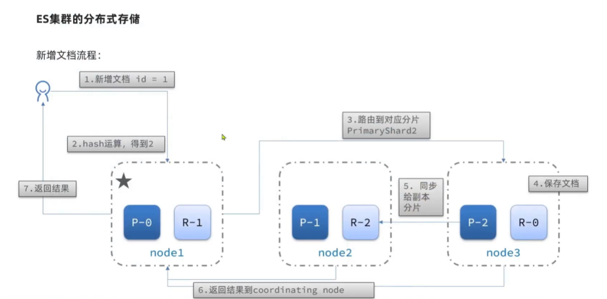
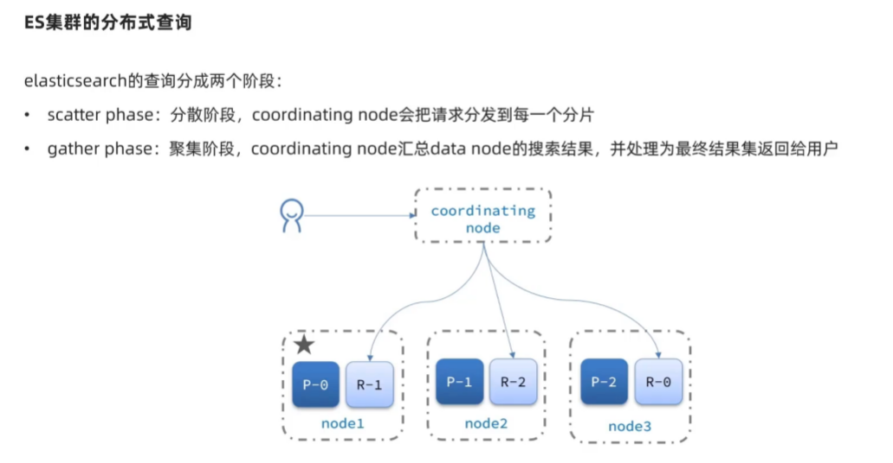
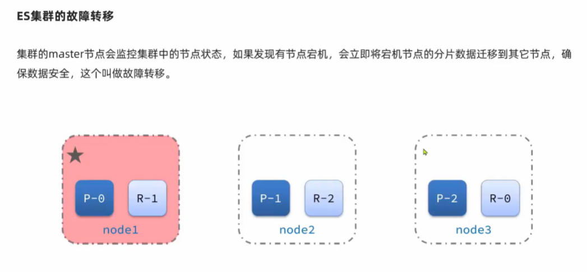
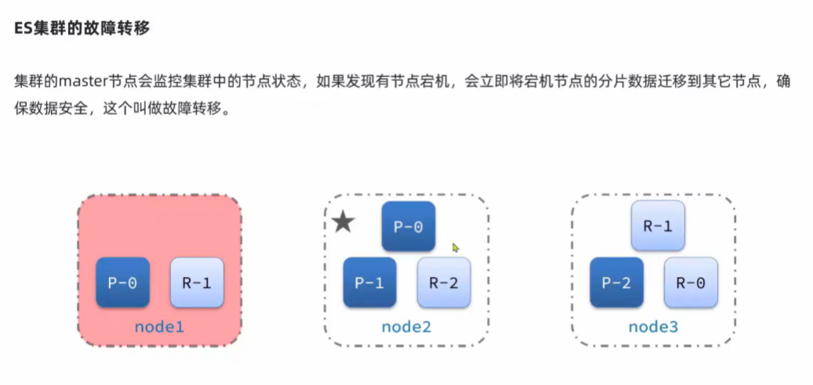

# 安装ElasticSearch

```shell
docker network create es-net

docker run -d --name es -e "ES_JAVA_OPTS=-Xms512m -Xmx512m" -e "discovery.type=single-node" -v es-data:/usr/share/elasticsearch/data -v es-plugins:/usr/share/elasticsearch/plugins --privileged --network es-net -p 9200:9200 -p 9300:9300 elasticsearch:7.12.1
```

---

# 安装Kibana

```shell
docker run -d --name kibana -e ELASTICSEARCH_HOST=http://es:9200 --network=es-net -p 5601:5601 kibana:7.12.1
```

## kibana 报错 server is not ready yet

解决方法：将配置文件kibana.yml中的elasticsearch.url改为正确的链接，默认为: http://elasticsearch:9200

具体步骤如下：


我们先进入 Kibana 容器内部，修改 kibana.yml 中的ip

```shell
$ docker exec -it kibana容器id /bin/bash
$ cd config
$ vi kibana.yml
```

```shell
#
# ** THIS IS AN AUTO-GENERATED FILE **
#
# Default Kibana configuration for docker target
server.name: kibana
server.host: "0"
elasticsearch.hosts: [ "http://elasticsearch:9200" ]
xpack.monitoring.ui.container.elasticsearch.enabled: true
```

只需要将上面的 "http://elasticsearch:9200" 改为"http://es:9200"就行了。


修改完成之后退出容器，重新启动即可 docker restart  kibana容器id


# 安装IK分词器

进入容器内部

```shell
docker exec -it es /bin/bash
```

执行在线安装命令

```shell
/bin/elasticsearch-plugin install https://get.infini.cloud/elasticsearch/analysis-ik/releases/download/v7.12.1/elasticsearch-analysis-ik-7.12.1.zip
```

退出容器并重启ES

```shell
exit
docker restart es
```

测试：
IK分词器包含两种模式：
- `ik_small`:最小切分
- `ik_max_word`:最细切分

# 安装拼音分词器

进入容器内部

```shell
docker exec -it es /bin/bash
```

执行在线安装命令

```shell
bin/elasticsearch-plugin install https://get.infini.cloud/elasticsearch/analysis-pinyin/7.12.1
```
退出容器并重启ES

```shell
exit
docker restart es
```

测试：
- `pinyin`:拼音


# 什么是ElasticSearch?

Elasticsearch（简称 ES）是一个基于 Apache Lucene 构建的开源分布式搜索与分析引擎，专为处理大规模数据的实时搜索、分析和存储而设计。以下是其核心介绍：

---

### 一、核心特点
1. **分布式架构**  
   支持水平扩展，数据自动分片存储于多个节点，并通过副本机制实现高可用性。例如，一个索引可分割为多个分片（Shard），分布在不同服务器上，且每个分片可配置副本（Replica）以容灾。

2. **实时性与高性能**  
   数据写入后几乎立即可被检索（近实时搜索），且支持复杂查询（如模糊匹配、范围查询）和聚合分析（如统计、分组），适用于 PB 级数据处理。

3. **灵活的数据模型**  
   支持结构化（如数字、日期）和非结构化数据（如文本、日志），通过动态映射自动推断字段类型，无需预定义 Schema。

4. **丰富的生态系统**  
   与 Logstash（数据采集）、Kibana（可视化）组成 ELK 技术栈，广泛应用于日志管理、监控等场景。

---

### 二、技术原理
1. **倒排索引**  
   基于 Lucene 的倒排索引结构，将文档内容分解为词项（Term），建立词项到文档的映射，显著提升全文检索效率。例如，搜索“实时分析”时，直接定位包含该词项的文档。

2. **分片与副本机制**  
   索引被拆分为多个分片，每个分片可跨节点分布；副本分片提供数据冗余和负载均衡，确保集群高可用性。

3. **RESTful API**  
   通过 HTTP 接口操作数据，支持 JSON 格式的索引创建、文档增删改查及复杂查询（如布尔组合、聚合分析）。

---

### 三、应用场景
1. **全文搜索**  
   适用于电商商品搜索（如京东、淘宝的多条件筛选）、百科内容检索等，支持高亮、分页和相关性排序（BM25 算法）。

2. **日志分析与监控**  
   实时采集系统日志（如服务器错误日志），结合 Kibana 生成可视化仪表盘，用于故障排查与性能优化。

3. **实时数据分析**  
   对业务数据（如销售额、用户行为）进行实时聚合分析，生成报表或支持决策。

4. **安全与地理信息**  
   安全情报分析（SIEM）中检测异常事件，或处理地理位置数据（如物流路径规划）。

5. **推荐系统**  
   基于用户行为数据构建推荐模型，实现个性化内容推送。

---

### 四、优缺点
- **优点**：
    - 扩展性强，支持动态扩容；
    - 社区活跃，插件生态丰富（如中文分词器 IK）；
    - 兼容多种数据类型和复杂查询。

- **缺点**：
    - 资源消耗较高（内存、磁盘）；
    - 集群管理复杂度高，需专业运维；
    - 不支持事务，不适合强一致性场景。

---

### 五、总结
Elasticsearch 凭借其分布式架构和强大的检索能力，成为大数据时代处理非结构化数据的核心工具。从搜索引擎到实时分析，其应用覆盖电商、金融、物联网等多个领域。然而，实际部署需权衡资源成本与管理复杂度，结合业务需求选择合适方案。

---

### 倒排索引的定义与核心原理
倒排索引（Inverted Index）是一种高效的数据结构，用于快速检索大规模文本数据中的信息。其核心思想是通过**属性值（如单词）反向定位包含该属性的文档**，而非传统索引中通过文档查找属性值的方式。例如，在搜索引擎中，用户输入关键词“实时分析”，倒排索引能直接返回包含该词的所有文档列表。


#### 1. **组成结构**
倒排索引主要由两部分构成：
- **单词词典（Term Dictionary）**：存储所有唯一的单词或词项，并按字典序排列，支持快速查找（如二分法或哈希表）。
- **倒排列表（Posting List）**：记录每个单词对应的文档信息，通常包括：
    - **文档编号（DocID）**：标识包含该单词的文档；
    - **词频（TF）**：单词在文档中的出现次数；
    - **位置信息（Position）**：单词在文档中的具体位置（如字符或词序位置）。

例如，单词“live”的倒排列表可能表示为：`{DocID: 1, TF: 2, Positions: [2, 5]}, {DocID: 2, TF: 1, Position: 2}`。

#### 2. **构建流程**
倒排索引的生成通常分为以下步骤：
1. **分词处理**：将文本拆分为单词（如英文按空格分隔，中文需分词工具处理）；
2. **规范化处理**：过滤停用词（如“的”“is”）、统一大小写、词干提取（如“lives”→“live”）；
3. **生成倒排列表**：记录每个单词的文档分布及位置信息；
4. **压缩与存储优化**：通过差值编码（如DocID差值转换为小整数）、位图压缩等技术减少存储空间。

#### 3. **应用场景**
- **全文搜索**：如搜索引擎中快速匹配用户查询词（Google、百度均依赖倒排索引）；
- **日志分析**：通过关键词定位系统日志中的异常事件；
- **推荐系统**：基于用户行为关键词匹配相关内容。

#### 4. **优势与局限性**
- **优势**：
    - **查询高效**：复杂度接近O(1)，适合海量数据实时检索；
    - **灵活扩展**：支持分布式存储（如Elasticsearch的分片机制）。
- **局限性**：
    - **存储成本高**：需额外空间存储位置和词频信息；
    - **更新复杂**：新增文档需重建或合并索引，影响实时性。

#### 5. **扩展优化技术**
- **量化存储**：使用位图（Bitmap）压缩文档位置信息；
- **混合索引**：结合B-Tree、哈希表加速词典查询；
- **增量更新**：采用“再合并策略”减少全量重建的开销。

### 总结
倒排索引通过反向映射实现从关键词到文档的快速定位，是搜索引擎、日志分析等场景的核心技术。尽管存在存储和更新成本，但其高效的检索能力使其在大数据时代不可或缺。实际应用中需结合压缩算法、分布式架构等优化手段，以平衡性能与资源消耗。


---

### Elasticsearch 与 MySQL 的核心区别

#### 一、**数据模型**
1. **MySQL**
    - **关系型数据库**：数据以表格形式存储，需预定义 Schema（列名、数据类型、约束等），支持主键、外键等关系型特性。
    - **结构化数据**：适用于事务处理（如订单、用户信息），数据格式严格，修改字段需手动调整表结构。
    - **示例**：存储用户信息时需提前定义 `id`、`name`、`age` 等字段。

2. **Elasticsearch**
    - **文档型数据库**：数据以 JSON 文档存储，无固定 Schema，支持动态映射（自动推断字段类型）。
    - **非结构化/半结构化数据**：灵活存储日志、文本、嵌套对象等复杂数据，字段可动态增减。
    - **示例**：同一索引下可同时存在 `title`（文本）和 `tags`（数组）等不同结构的文档。

---

#### 二、**查询语言与功能**
1. **MySQL**
    - **SQL 查询**：支持复杂事务（ACID）、JOIN 操作、聚合函数（GROUP BY）等，适合精确查询和关系型数据分析。
    - **局限性**：全文搜索性能较差（需依赖全文索引），且分词能力有限。

2. **Elasticsearch**
    - **RESTful API 与 Query DSL**：基于 JSON 的查询语法，支持全文检索、模糊匹配、相关性评分等功能。
    - **局限性**：不支持事务和复杂 JOIN，数据操作立即生效，无回滚机制。

---

#### 三、**索引与搜索机制**
1. **MySQL**
    - **B树/B+树索引**：适用于精确查询（如 `WHERE id=1`）和范围查询，索引需手动创建和维护。
    - **行存储**：数据按行存储，适合频繁更新的事务型操作。

2. **Elasticsearch**
    - **倒排索引**：通过词项（Term）到文档的映射实现高效全文搜索，支持分词器（如中文 IK 分词）和复杂搜索类型（短语、模糊搜索）。
    - **列存储（Lucene 段结构）**：优化批量查询和分析性能，适合聚合统计。

---

#### 四、**分布式与扩展性**
1. **MySQL**
    - **单机为主**：通过主从复制、分库分表实现扩展，需手动配置集群，管理复杂度高。
    - **垂直扩展**：依赖硬件升级（如 CPU、内存）提升性能，成本较高。

2. **Elasticsearch**
    - **天生分布式**：数据自动分片（Shard）并分布到多个节点，副本机制（Replica）保障高可用，支持动态扩容。
    - **水平扩展**：通过增加节点处理 PB 级数据，自动负载均衡和故障恢复。

---

#### 五、**性能与应用场景**
| **场景**                | **MySQL**                          | **Elasticsearch**                      |
|-------------------------|------------------------------------|----------------------------------------|
| **事务处理**            | ✅ 高并发事务（如支付系统）  | ❌ 不支持事务                          |
| **复杂查询**            | ✅ 多表 JOIN、聚合分析       | ❌ 仅支持嵌套文档替代 JOIN      |
| **全文搜索**            | ❌ 性能差（依赖全文索引）        | ✅ 毫秒级响应，支持分词和高亮  |
| **实时分析**            | ❌ 适合离线报表                 | ✅ 近实时聚合（如日志监控）     |
| **数据规模**            | ❌ 单表千万级后性能下降          | ✅ 支持 PB 级数据              |

---

#### 六、**典型使用场景**
1. **MySQL**
    - 金融交易系统（强一致性需求）。
    - Web 应用后端（用户管理、订单处理）。
    - 复杂业务查询（如 ERP 系统）。

2. **Elasticsearch**
    - 搜索引擎（电商商品搜索、内容检索）。
    - 日志分析（ELK 技术栈）。
    - 实时监控（指标聚合、异常检测）。

---

### 总结与选型建议
- **选择 MySQL**：当需要事务支持、复杂 SQL 查询或结构化数据管理时。
- **选择 Elasticsearch**：当处理全文搜索、非结构化数据或大规模实时分析时。
- **混合使用**：常见方案是将 MySQL 作为主数据库，同步部分数据到 ES 用于搜索和分析（如电商平台商品库）。

通过以上对比，可根据业务需求权衡两者特性，或结合使用以发挥各自优势。


---

# 索引库操作

## mapping映射属性

以下是Elasticsearch中Mapping映射属性的综合解析，结合核心功能和实际应用场景分类说明：

---

### 一、核心字段类型（Field Types）
1. **文本类型**
    - **text**：长文本字段（如文章内容），默认启用分词并创建倒排索引，支持全文搜索。  
      *示例*：`{"type": "text", "analyzer": "ik_max_word"}`
    - **keyword**：短文本或不可分词的字段（如ID、标签），支持精确匹配、排序和聚合。  
      *示例*：`{"type": "keyword", "ignore_above": 256}`

2. **数值类型**
    - **整数型**：`long`（64位）、`integer`（32位）、`short`（16位）、`byte`（8位）。
    - **浮点型**：`double`（双精度）、`float`（单精度），适用于价格、评分等场景。  
      *示例*：`{"type": "float"}`

3. **日期类型（date）**
    - 支持多种格式（如`yyyy-MM-dd`），存储为UTC毫秒时间戳，用于范围查询和时间聚合。  
      *示例*：`{"type": "date", "format": "yyyy-MM-dd"}`

4. **布尔类型（boolean）**
    - 仅存储`true`/`false`，适用于状态标记字段。

5. **对象与嵌套类型**
    - **object**：普通JSON对象，子字段通过`properties`定义（如`user.name`）。
    - **nested**：独立存储对象数组，避免扁平化数据丢失关联性，适用于订单商品等复杂结构。

---

### 二、索引与存储属性
1. **index**
    - 控制字段是否被索引：
        - `true`（默认）：生成倒排索引，支持搜索/排序。
        - `false`：仅存储原始值，不可搜索（如日志字段）。  
          *示例*：`{"index": false}`

2. **store**
    - 是否独立存储原始值（默认`false`），开启后可直接读取，避免解析`_source`提升性能，但增加存储开销。

3. **doc_values**
    - 列式存储，默认启用（除`text`字段），用于高效排序、聚合和脚本计算。

4. **norms**
    - 存储字段长度归一化因子，影响相关性评分，对无需评分的过滤字段可禁用以节省空间。

---

### 三、分词与数据处理
1. **analyzer**
    - 指定索引时的分词器（如`ik_max_word`细粒度分词），仅适用于`text`字段。  
      *示例*：`{"analyzer": "ik_smart"}`

2. **search_analyzer**
    - 独立设置搜索时的分词器（默认与`analyzer`一致），用于处理查询条件的分词逻辑。

3. **null_value**
    - 定义空值的替代值（如`-1`），确保缺失字段在查询/聚合中保持一致性。  
      *示例*：`{"null_value": "N/A"}`

---

### 四、动态与高级配置
1. **dynamic**
    - 控制动态映射行为：
        - `true`（默认）：自动推断新字段类型。
        - `false`：忽略新字段。
        - `strict`：发现未知字段则报错。

2. **动态模板（dynamic_templates）**
    - 基于字段名或类型自动应用映射规则，例如将所有`long_`前缀字段设为`integer`类型。  
      *示例*：
      ```json
      "dynamic_templates": [{
        "integers": {"match_mapping_type": "long", "mapping": {"type": "integer"}}
      }]
      ```

3. **多字段（fields）**
    - 单字段多用途定义，如`text`主字段分词搜索，`keyword`子字段精确聚合。  
      *示例*：
      ```json
      "name": {"type": "text", "fields": {"raw": {"type": "keyword"}}}
      ```

---

### 五、元数据字段
1. **_source**
    - 默认存储原始文档，禁用后可节省空间，但无法高亮或部分更新（需通过`includes`/`excludes`过滤字段）。

2. **_all**
    - （已废弃）曾用于跨字段全文搜索，现推荐使用`copy_to`自定义组合字段。

---

### 注意事项
- **字段类型不可修改**：已有字段的类型、分词器等属性无法直接更新，需通过重建索引迁移数据。
- **性能权衡**：频繁聚合的字段建议启用`doc_values`，高基数文本字段避免启用`fielddata`（内存消耗大）。

通过合理配置映射属性，可以显著优化存储效率、查询性能及业务适配性。实际应用中建议结合Kibana的索引模板功能统一管理映射规则。

---


## 索引库的CRUD

Elasticsearch中的索引库操作是数据管理的基础，以下是核心操作及注意事项的综合介绍：

### 一、索引库的创建
1. **基本语法**  
   通过`PUT`请求定义索引名称、分片数、副本数及字段映射。例如：
   ```bash
   PUT /my_index
   {
     "settings": {
       "number_of_shards": 3,    # 主分片数（创建后不可修改）
       "number_of_replicas": 2   # 副本数（可动态调整）
     },
     "mappings": {
       "properties": {
         "title": {"type": "text", "analyzer": "ik_smart"},
         "author": {"type": "keyword"}
       }
     }
   }
   ```
   工具支持：可通过Kibana DevTools、curl或Postman执行。

2. **映射规则**
    - **字段类型**：需明确指定（如`text`支持分词，`keyword`用于精确匹配）。
    - **动态映射**：未定义字段时自动推断类型，但生产环境建议显式定义以避免意外结构。

3. *示例*：

```bash
# 创建索引库
PUT /heima
{
  "mappings": {
    "properties": {
      "info":{
        "type":"text",
        "analyzer": "ik_smart"
      },
      "email":{
        "type":"keyword",
        "index":"false"
      },
      "name":{
        "type": "object",
        "properties": {
          "firstName":{
            "type":"keyword"
          },
          "lastName":{
            "type":"keyword"
          }
        }
      }
    }
  }
}
```

### 二、索引库的查询
1. **查看所有索引**
   ```bash
   GET _cat/indices?v  # 返回分片、文档数等摘要信息
   ```
2. **查看单个索引详情**
   ```bash
   GET /my_index?pretty  # 包含映射、设置及状态详情
   ```

### 三、索引库的更新
1. **动态设置调整**  
   修改副本数等可动态调整的参数：
   ```bash
   PUT /my_index/_settings
   {"number_of_replicas": 1}
   ```
2. **映射扩展**  
   添加新字段（已有字段类型不可修改）：
   ```bash
   PUT /my_index/_mapping
   {
     "properties": {
       "publish_date": {"type": "date", "format": "yyyy-MM-dd"}
     }
   }
   ```
   注意：修改已有字段需重建索引。

3. *示例*：
```bash
# 添加新字段
PUT /heima/_mapping
{
  "properties":{
    "age":{
      "type":"integer"
    }
  }
}
```

### 四、索引库的删除
```bash
DELETE /my_index  # 直接删除索引及数据
```
**风险提示**：避免使用通配符（如`DELETE /*`）误删数据，建议配置`action.destructive_requires_name: true`限制此操作。

### 五、高级操作
1. **别名管理**  
   通过别名实现索引分组或版本切换：
   ```bash
   PUT /my_index/_alias/v2  # 创建别名
   ```
2. **索引监控**  
   使用`HEAD /my_index`验证索引是否存在，或通过`_cluster/health`检查健康状态。

### 注意事项
- **分片策略**：主分片数需在创建时确定，副本数可后续调整，合理分配以平衡性能与容灾。
- **安全性**：生产环境应限制通配符删除权限，避免数据丢失。
- **性能优化**：对频繁查询但无需检索的字段设置`index: false`，减少存储开销。

通过以上操作可高效管理Elasticsearch索引，建议结合Kibana的可视化工具简化日常维护。

---

# 文档操作

以下是 Elasticsearch 中文档操作的详细介绍，涵盖增删改查及高级功能，结合最新版本（截至2025年）特性整理：

---

### 一、文档创建（Create）
1. **指定ID创建**  
   使用 `PUT` 请求，明确指定文档ID，适用于业务主键已知场景：
   ```bash
   PUT /my_index/_doc/1
   {
     "title": "Elasticsearch教程",
     "author": "MikeChen",
     "content": "从零学习ES核心操作"
   }
   ```
    - `_index` 为索引名称，`_doc` 为默认类型（7.x后类型已废弃），`1` 为自定义ID。
    - 若ID已存在，会触发覆盖更新。

2. **自动生成ID创建**  
   使用 `POST` 请求，由ES自动生成唯一ID（如 `TMCtW3YB6Yv6dK2N-lA4`）：
   ```bash
   POST /my_index/_doc
   {
     "title": "自动生成ID示例",
     "tags": ["搜索", "大数据"]
   }
   ```
    - 适用于无业务主键或批量插入场景。

3. *示例*：

```bash
POST /heima/_doc/1
{
  "info":"tangfire",
  "email":"123456@qq.com",
  "name":{
    "firstName":"云",
    "lastName":"赵"
  },
  "age":23
}
```

---

### 二、文档查询（Read）
1. **单文档查询**  
   通过ID精确获取文档内容：
   ```bash
   GET /my_index/_doc/1
   ```
    - 返回包含元数据（`_version`、`_seq_no`）及原始数据（`_source`）。

2. **条件搜索**  
   使用查询DSL实现灵活搜索：
   ```bash
   GET /my_index/_search
   {
     "query": {
       "bool": {
         "must": [
           { "match": { "title": "教程" } },
           { "range": { "publish_date": { "gte": "2024-01-01" } } }
         ]
       }
     }
   }
   ```
    - 支持组合查询（`must`/`should`/`must_not`）、范围过滤等。

3. **批量查询（Multi-Get）**  
   通过ID列表批量获取文档：
   ```bash
   GET /my_index/_mget
   {
     "ids": ["1", "2", "3"]
   }
   ```
    - 提升批量处理效率。


4. *示例*:

```bash
GET /heima/_doc/1
```

---

### 三、文档更新（Update）
1. **全局替换（Replace）**  
   使用 `PUT` 覆盖整个文档，旧文档被标记删除后新建：
   ```bash
   PUT /my_index/_doc/1
   {
     "title": "更新后标题",
     "content": "全新内容版本"
   }
   ```
    - 适用于全字段更新，但会触发版本递增（`_version`）。

*示例*：

```bash
PUT /heima/_doc/1
{
  "info":"tangfire",
  "email":"123456@qq.com",
  "name":{
    "firstName":"火",
    "lastName":"赵"
  },
  "age":23
}
```

2. **部分更新（Partial Update）**  
   通过 `_update` API修改指定字段，减少数据传输量：
   ```bash
   POST /my_index/_update/1
   {
     "doc": {
       "title": "仅更新标题",
       "views": 1000
     }
   }
   ```
    - 支持脚本（Painless）动态计算字段值。

*示例*：

```bash
POST /heima/_update/1
{
  "doc":{
    "email":"5666123@qq.com"
  }
}
```

3. **条件更新（Update by Query）**  
   根据查询结果批量更新匹配文档：
   ```bash
   POST /my_index/_update_by_query
   {
     "script": "ctx._source.views += params.increment",
     "params": { "increment": 10 },
     "query": { "term": { "status": "active" } }
   }
   ```
    - 常用于日志状态批量修正等场景。

---

### 四、文档删除（Delete）
1. **单文档删除**  
   通过ID直接删除：
   ```bash
   DELETE /my_index/_doc/1
   ```
    - 实际为逻辑删除标记，物理删除在段合并时执行。

2. **条件删除（Delete by Query）**  
   批量删除匹配查询条件的文档：
   ```bash
   POST /my_index/_delete_by_query
   {
     "query": {
       "range": { "create_time": { "lt": "2020-01-01" } }
     }
   }
   ```
    - 需注意性能影响，建议分页处理大数据量。

3. **批量删除（Bulk API）**  
   在单个请求中混合多种操作：
   ```bash
   POST /_bulk
   { "delete": { "_index": "my_index", "_id": "1" } }
   { "delete": { "_index": "my_index", "_id": "2" } }
   ```
    - 提升大规模删除效率。

---

### 五、高级操作
1. **版本控制（Versioning）**
    - 每次操作递增 `_version`，防止并发冲突（如乐观锁机制）。
    - 示例：`POST /my_index/_update/1?version=2` 指定版本更新。

2. **批量处理（Bulk Operations）**
    - 支持混合插入、更新、删除操作，减少网络开销：
      ```bash
      POST /_bulk
      { "index": { "_index": "my_index", "_id": "3" } }
      { "title": "批量插入" }
      { "update": { "_index": "my_index", "_id": "1" } }
      { "doc": { "status": "archived" } }
      ```


3. **异步操作与冲突处理**
    - 使用 `refresh=wait_for` 参数确保操作可见性。
    - 通过 `retry_on_conflict` 自动重试版本冲突操作。

---

### 注意事项
- **性能优化**：批量操作建议每批次1000-5000文档，避免内存溢出。
- **数据安全**：删除索引前确认无误，可配置 `action.destructive_requires_name: true` 防止误删。
- **映射规划**：更新字段类型需重建索引，建议初期明确定义映射规则。

如需更详细语法或案例，可参考 Elasticsearch 官方文档或上述来源中的具体示例。

---


Elasticsearch 的地理坐标数据类型是其处理地理位置数据的核心功能，主要包含以下两类，支持多样化的地理空间查询与分析场景：

---

### 一、Geo-point 类型
**定义**  
用于表示单个地理坐标点（经纬度），支持精确的地理位置存储与查询，适用于点状数据场景（如标记店铺位置、用户实时定位等）。

#### 1. **数据格式**
- **字符串格式**：`"lat,lon"`，如 `"40.715,-74.011"`（纬度在前，经度在后）。
- **对象格式**：`{"lat": 40.715, "lon": -74.011}`。
- **数组格式**：`[lon, lat]`，如 `[-74.011, 40.715]`（经度在前，纬度在后，需注意与字符串顺序相反）。

#### 2. **映射声明示例**
```json
PUT /locations
{
  "mappings": {
    "properties": {
      "name": {"type": "keyword"},
      "coordinate": {"type": "geo_point"}
    }
  }
}
```

#### 3. **典型应用场景**
- **附近搜索**：查找距离某坐标点 5 公里内的所有餐厅。
- **聚合分析**：统计某区域内用户分布密度。
- **排序**：按距离从近到远排序结果。

---

### 二、Geo-shape 类型
**定义**  
用于表示复杂地理形状（如多边形、线条、圆形等），支持地理围栏查询和空间关系判断（相交、包含等），适用于区域范围分析。

#### 1. **支持的形状类型**
- **点（Point）**：单个坐标点，与 `geo_point` 类似。
- **线条（LineString）**：由多个点连成的线（如道路轨迹）。
- **多边形（Polygon）**：闭合区域（如行政区划）。
- **圆形（Circle）**：基于中心点和半径定义的圆形区域。

#### 2. **数据格式**
采用 **GeoJSON 标准**，例如定义一个多边形：
```json
{
  "type": "polygon",
  "coordinates": [
    [[-74.1, 40.73], [-74.1, 40.71], [-74.01, 40.71], [-74.01, 40.73], [-74.1, 40.73]]
  ]
}
```

#### 3. **映射声明示例**
```json
PUT /regions
{
  "mappings": {
    "properties": {
      "name": {"type": "keyword"},
      "boundary": {"type": "geo_shape"}
    }
  }
}
```

#### 4. **典型应用场景**
- **物流规划**：判断配送地址是否在某个仓库覆盖范围内。
- **地理围栏**：监控设备是否进入禁入区域（如军事禁区）。
- **区域统计**：分析某省份内的用户活跃度。

---

### 三、核心操作与注意事项
#### 1. **地理查询类型**
- **距离查询（Geo Distance）**：筛选指定半径内的点。
  ```json
  {
    "query": {
      "geo_distance": {
        "distance": "5km",
        "coordinate": {"lat": 40.715, "lon": -74.011}
      }
    }
  }
  ```
- **边界框查询（Geo Bounding Box）**：筛选矩形区域内的点。
- **形状关系查询（Geo Shape）**：判断点是否在某个形状内。

#### 2. **性能优化建议**
- **索引配置**：为 `geo_shape` 字段指定 `quadtree` 树结构，优化复杂形状的查询效率。
- **精度控制**：通过 `precision` 参数平衡存储开销与查询精度（如 `"precision": "10m"`）。

#### 3. **常见误区**
- **经纬度顺序**：字符串与数组格式的经纬度顺序相反，需特别注意以避免数据错误。
- **动态映射限制**：地理坐标类型需显式声明，无法通过动态映射自动推断。

---

### 四、应用案例
**案例：附近商家搜索**
1. 使用 `geo_point` 存储商家经纬度。
2. 用户提交坐标后，通过 `geo_distance` 查询 3 公里内的商家。
3. 结果按距离排序，并聚合统计各商家的平均评分。

---

通过合理使用 `geo_point` 和 `geo_shape`，Elasticsearch 能够高效支持从简单点到复杂区域的地理空间分析需求，广泛应用于物流、社交、物联网等领域。


---


以下是关于 Elasticsearch 中 `copy_to` 功能的详细介绍，结合其核心逻辑、应用场景及注意事项整理：

---

### 一、`copy_to` 的核心功能
`copy_to` 是 Elasticsearch 映射（mapping）中的一个参数，**允许将多个源字段的值复制到一个目标字段中**，从而简化查询逻辑并提升性能。其核心机制如下：
1. **数据合并**：将多个字段的原始值（未分析）合并到目标字段，例如将 `first_name` 和 `last_name` 复制到 `full_name`。
2. **索引优化**：目标字段独立建立索引，支持统一查询，避免多字段联合查询的复杂性。

---

### 二、使用场景与优势
#### 1. **多字段联合搜索**
- **简化查询语句**：无需对每个源字段单独查询，直接搜索目标字段。例如：
  ```json
  GET /my_index/_search
  {
    "query": {
      "match": {
        "full_name": "John Smith"  // 同时搜索 first_name 和 last_name
      }
    }
  }
  ```
  替代复杂的 `bool` 组合查询。
- **提升效率**：减少查询涉及的字段数量，降低索引压力。

#### 2. **日志分析与数据聚合**
- **统一分析字段**：将分散的日志字段（如 `error_code` 和 `error_message`）合并到 `error_context`，便于统一分析。
- **支持聚合操作**：目标字段可参与聚合统计，例如合并用户行为标签进行频次分析。

#### 3. **嵌套对象与复杂结构**
- **跨嵌套字段合并**：例如将商品属性（`properties.title`）和 SKU 描述（`skus.description`）合并到 `search_keywords`，实现跨嵌套结构的统一搜索。

---

### 三、配置方式与语法
#### 1. **映射定义**
在索引映射中为源字段指定 `copy_to` 参数，指向目标字段：
```json
PUT /my_index
{
  "mappings": {
    "properties": {
      "first_name": {
        "type": "text",
        "copy_to": "full_name"  // 单目标字段
      },
      "last_name": {
        "type": "text",
        "copy_to": ["full_name", "search_terms"]  // 多目标字段
      },
      "full_name": { "type": "text" }
    }
  }
}
```
- **支持多目标**：通过数组形式将值复制到多个字段。

#### 2. **目标字段属性**
- **类型兼容性**：目标字段类型需兼容源字段类型。例如，`text` 类型可合并 `keyword` 字段，但数值类型需统一。
- **显式存储**：默认目标字段不存储原始值（仅索引），若需在结果中展示，需设置 `"store": true`。

---

### 四、注意事项与限制
1. **数据可见性**
   - 目标字段不会出现在 `_source` 中，除非显式配置 `"store": true`。
   - 修改源字段值后需重新索引文档，目标字段才会更新。

2. **类型与分词限制**
   - **仅支持未分析值**：复制的是字段原始值，非分词后的词项。例如 `text` 字段复制的是完整字符串，而非分词结果。
   - **不兼容复杂类型**：如 `date_range` 或 `object` 类型无法使用 `copy_to`。

3. **性能影响**
   - **存储开销**：目标字段会占用额外存储空间，需权衡合并的必要性。
   - **索引速度**：大量字段合并可能降低写入性能。

---

### 五、最佳实践
1. **合理选择目标字段类型**
   - 若需分词搜索，目标字段设为 `text`；若需精确匹配，设为 `keyword`。
   - 示例：合并 `title` 和 `description` 到 `search_content`，并启用 IK 分词器。

2. **结合动态模板**  
   使用动态模板自动为特定前缀字段配置 `copy_to`，例如将 `tag_` 开头的字段统一复制到 `all_tags`。

3. **版本兼容性**
   - Elasticsearch 6.7+ 强化了 `copy_to` 功能，建议使用较新版本。

---

通过合理应用 `copy_to`，可显著优化搜索逻辑、简化查询复杂度，尤其适用于多字段联合搜索和日志分析场景。实际使用中需结合业务需求权衡存储与性能成本。


---


以下是基于 Elasticsearch RestClient 操作索引库的详细指南，结合核心功能与最佳实践整理：

---

### 一、环境准备与客户端初始化
1. **依赖引入**  
   Maven 项目中需添加以下依赖（版本需与 ES 集群一致，推荐 7.x+）：
   ```xml
   <dependency>
       <groupId>org.elasticsearch.client</groupId>
       <artifactId>elasticsearch-rest-high-level-client</artifactId>
       <version>7.12.1</version>
   </dependency>
   ```

2. **客户端配置**  
   在 Spring Boot 中通过配置类初始化单例客户端：
   ```java
   @Bean
   public RestHighLevelClient restHighLevelClient() {
       return new RestHighLevelClient(
           RestClient.builder(HttpHost.create("http://localhost:9200"))
       );
   }
   ```

---

### 二、索引库核心操作
#### 1. **创建索引库**
**步骤**：
- 创建 `CreateIndexRequest` 对象，指定索引名称（如 `hotel`）
- 定义映射（Mapping）模板，包含字段类型、分词器等配置
- 发送请求并处理响应

**示例代码**：
```java
@Test
void testCreateIndex() throws IOException {
    // 1. 创建请求对象
    CreateIndexRequest request = new CreateIndexRequest("hotel");
    // 2. 加载预定义映射模板（JSON格式）
    request.source(HotelConstants.MAPPING_TEMPLATE, XContentType.JSON);
    // 3. 发送请求
    client.indices().create(request, RequestOptions.DEFAULT);
}
```
**映射模板关键配置**：
- `geo_point` 类型处理地理坐标
- `copy_to` 合并多字段（如将 `name`、`brand` 复制到 `all` 字段提升搜索效率）
- `ik_max_word` 分词器优化中文分词

#### 2. **删除索引库**
**步骤**：
- 创建 `DeleteIndexRequest` 对象
- 直接发送删除请求

**示例代码**：
```java
@Test
void testDeleteIndex() throws IOException {
    DeleteIndexRequest request = new DeleteIndexRequest("hotel");
    client.indices().delete(request, RequestOptions.DEFAULT);
}
```

#### 3. **判断索引库是否存在**
**步骤**：
- 创建 `GetIndexRequest` 对象
- 调用 `exists()` 方法验证

**示例代码**：
```java
@Test
void testIndexExists() throws IOException {
    GetIndexRequest request = new GetIndexRequest("hotel");
    boolean exists = client.indices().exists(request, RequestOptions.DEFAULT);
    System.out.println(exists ? "索引库存在" : "索引库不存在");
}
```

---

### 三、高级配置与最佳实践
1. **动态模板（Dynamic Templates）**  
   通过 `dynamic_templates` 自动为新字段应用规则（如将 `long_` 前缀字段设为 `integer` 类型）：
   ```json
   "dynamic_templates": [{
       "integers": {"match_mapping_type": "long", "mapping": {"type": "integer"}}
   }]
   ```

2. **性能优化**
   - **批量操作**：使用 `BulkRequest` 合并请求，每批次处理 1000-5000 文档
   - **存储控制**：非必要字段禁用 `doc_values` 或设置 `index: false` 减少存储开销

3. **错误处理**
   - 检查响应状态（如 `AcknowledgedResponse.isAcknowledged()`）
   - 日志记录失败操作以便重试

---

### 四、注意事项
1. **版本一致性**  
   客户端版本必须与 Elasticsearch 服务端版本严格匹配，避免兼容性问题

2. **映射不可变性**  
   已存在的字段类型、分词器等属性无法直接修改，需通过重建索引迁移数据

3. **资源释放**  
   操作完成后调用 `client.close()` 释放连接，防止内存泄漏

---

### 五、典型应用场景
1. **电商平台**
   - 创建商品索引时，合并 `title` 与 `description` 到 `search_content` 字段提升搜索效率
   - 使用 `geo_point` 实现基于位置的店铺推荐

2. **日志分析**
   - 动态模板自动处理日志字段类型
   - 定期删除过期日志索引释放存储空间

---

通过合理应用 RestClient 的索引操作 API，可高效管理 Elasticsearch 数据结构，优化存储与查询性能。建议结合 Kibana 的 Dev Tools 调试 DSL 语句，确保映射配置正确性。


---


以下是基于 Spring Boot 3.2+ 中 `RestClient` 的文档操作详解，结合其核心功能与最佳实践整理：

---

### 一、RestClient 初始化与配置
1. **创建实例**
   - 基础方式（自动检测 HTTP 客户端库）：
     ```java
     RestClient defaultClient = RestClient.create();
     ```
   - 高级配置（自定义请求工厂、消息转换器等）：
     ```java
     RestClient customClient = RestClient.builder()
         .baseUrl("http://api.example.com")  // 设置基础URL
         .defaultHeader("Content-Type", "application/json")  // 默认请求头
         .requestFactory(new HttpComponentsClientHttpRequestFactory())  // 使用Apache HttpClient
         .build();
     ```

---

### 二、文档操作核心 API
#### 1. **查询文档（GET）**
```java
// 获取单个文档
User user = customClient.get()
    .uri("/users/{id}", 101)  // 路径参数替换
    .retrieve()
    .body(User.class);  // 自动反序列化为对象

// 获取列表文档（泛型处理）
List<User> users = customClient.get()
    .uri("/users")
    .retrieve()
    .body(new ParameterizedTypeReference<List<User>>() {});
```

#### 2. **创建文档（POST）**
```java
User newUser = new User("张三", "zhangsan@example.com");
User createdUser = customClient.post()
    .uri("/users")
    .body(newUser)  // 自动序列化为JSON
    .retrieve()
    .body(User.class);
```

#### 3. **更新文档（PUT/PATCH）**
```java
// 全量更新（PUT）
User updatedUser = customClient.put()
    .uri("/users/{id}", 101)
    .body(updatedUser)
    .retrieve()
    .body(User.class);

// 部分更新（PATCH）
Map<String, Object> patchData = Map.of("email", "new_email@example.com");
customClient.patch()
    .uri("/users/{id}", 101)
    .body(patchData)
    .retrieve();
```

#### 4. **删除文档（DELETE）**
```java
customClient.delete()
    .uri("/users/{id}", 101)
    .retrieve();  // 无返回内容时直接调用
```

---

### 三、高级功能
#### 1. **请求头与认证**
```java
// 添加自定义请求头
customClient.get()
    .uri("/secure-data")
    .header("X-API-Key", "your-api-key")
    .retrieve();

// Bearer Token 认证
customClient.get()
    .uri("/profile")
    .headers(headers -> headers.setBearerAuth("token123"))
    .retrieve();
```

#### 2. **响应增强**
```java
// 获取完整响应对象（包含状态码、头信息）
ResponseEntity<User> response = customClient.get()
    .uri("/users/{id}", 101)
    .retrieve()
    .toEntity(User.class);

System.out.println("状态码：" + response.getStatusCode());
System.out.println("响应头：" + response.getHeaders());
```

#### 3. **错误处理**
```java
customClient.get()
    .uri("/users/999")
    .retrieve()
    .onStatus(status -> status.is4xxClientError(), (req, res) -> {
        throw new UserNotFoundException("用户不存在");
    })
    .body(User.class);
```

---

### 四、性能优化建议
1. **连接池配置**  
   通过 `RestClientBuilder` 自定义连接池参数（如最大连接数、超时时间）。

2. **批量操作**  
   使用 `Bulk Operations`（需结合具体 API 设计批量接口）。

3. **异步调用**（需结合 `CompletableFuture`）：
   ```java
   CompletableFuture<User> future = CompletableFuture.supplyAsync(() -> 
       customClient.get().uri("/users/101").retrieve().body(User.class)
   );
   ```

---

### 五、适用场景对比
| **场景**                | **推荐使用**      | **说明**                          |
|-------------------------|------------------|-----------------------------------|
| 简单同步请求            | RestClient       | 代码简洁，内置 JSON 转换          |
| 高并发/异步场景         | WebClient        | 非阻塞 I/O，响应式编程支持         |
| 旧系统维护              | RestTemplate     | 兼容早期 Spring 版本               |

---

### 六、注意事项
1. **版本兼容性**  
   需确保 Spring Boot 版本 ≥3.2，且与后端 API 的 HTTP 规范兼容。

2. **线程安全性**  
   `RestClient` 实例线程安全，建议全局单例复用。

3. **日志调试**  
   可通过拦截器记录请求/响应日志：
   ```java
   RestClient.builder()
       .requestInterceptor((req, body, execution) -> {
           System.out.println("请求URL：" + req.getURI());
           return execution.execute(req, body);
       });
   ```

如需更详细的参数配置或复杂用例实现，可参考官方文档。

---

以下是基于 Elasticsearch RestClient 实现高效批量数据导入的详细方案，结合多篇技术文档的最佳实践总结：

---

### 一、核心实现方案
#### 1. **BulkRequest 批量操作**
通过 `BulkRequest` 将多个文档操作合并为一个请求，相比单条插入效率提升 10 倍以上：
```java
BulkRequest request = new BulkRequest("索引名");
for (Item item : items) {
    request.add(new IndexRequest()
        .id(item.getId())
        .source(JSONUtil.toJsonStr(item), XContentType.JSON));
}
BulkResponse response = client.bulk(request, RequestOptions.DEFAULT);
```

#### 2. **分页循环导入**
采用分页查询数据库+批量导入策略，避免全量数据内存溢出：
```java
int pageNo = 1, size = 1000;
while (true) {
    Page<Item> page = itemService.page(new Page<>(pageNo, size));
    List<Item> items = page.getRecords();
    if (CollUtils.isEmpty(items)) break;
    
    BulkRequest bulkRequest = new BulkRequest();
    items.forEach(item -> bulkRequest.add(createIndexRequest(item)));
    client.bulk(bulkRequest, RequestOptions.DEFAULT);
    
    pageNo++;
}
```

---

### 二、性能优化策略
#### 1. **并发控制（线程池）**
使用固定线程池控制并发量，配合 `CountDownLatch` 监控任务完成度：
```java
ExecutorService executor = Executors.newFixedThreadPool(5); // 线程数=CPU核心数+1
CountDownLatch latch = new CountDownLatch(totalBatches);

for (List<Data> batch : batches) {
    executor.submit(() -> {
        bulkInsert(batch); // 执行批量插入
        latch.countDown();
    });
}
latch.await(); // 等待所有批次完成
```

#### 2. **关键参数调优**
| 参数                | 推荐值    | 作用                          |
|--------------------|----------|-----------------------------|
| 单批次数据量 (BATCH_SIZE) | 1000-5000 | 平衡内存与网络请求开销             |
| 线程池大小 (THREAD_COUNT)  | CPU核心数+1 | 最大化资源利用率                |
| 客户端超时时间         | 60s       | 避免因网络波动导致线程阻塞          |

---

### 三、异常处理机制
#### 1. 错误日志记录
```java
if (bulkResponse.hasFailures()) {
    System.err.println("批量导入失败项：" + bulkResponse.buildFailureMessage());
}
```
#### 2. 失败重试策略
对失败文档 ID 记录并实现自动重试逻辑（建议最多 3 次重试）

---

### 四、适用场景对比
| **场景**               | **推荐方案**          | **优势**                      | **来源**   |
|-----------------------|---------------------|-----------------------------|-----------|
| 百万级历史数据迁移       | Logstash + CSV      | 零编码，支持断点续传              |       |
| 实时增量数据同步         | RestClient 批量 API  | 灵活度高，可结合业务逻辑处理         |   |
| 高并发写入场景           | 线程池 + 分批次提交     | 资源可控，避免 OOM               |       |

---

### 五、注意事项
1. **版本兼容性**
   - RestHighLevelClient 需与 ES 服务端版本严格匹配（7.x 客户端连 7.x 集群）
2. **资源释放**
   - 操作完成后调用 `client.close()` 释放连接，防止内存泄漏
3. **索引优化**
   - 批量导入前临时关闭副本：`PUT /index/_settings {"number_of_replicas": 0}`
   - 导入后恢复副本并强制段合并：`POST /index/_forcemerge?max_num_segments=5`

---

通过合理选择批量策略和优化参数，RestClient 可实现每小时百万级数据的稳定导入。建议配合 Kibana 监控写入速率和 JVM 内存状态，具体实施方案可根据实际硬件配置调整。


---

以下是 Elasticsearch DSL 查询文档的核心概念与分类详解，结合多篇技术文档整理：

---

### 一、DSL 查询基础
**DSL（Domain Specific Language）** 是 Elasticsearch 基于 JSON 格式设计的领域特定查询语言，用于实现复杂的搜索交互。其核心功能包括全文检索、精确查询、地理查询、复合逻辑控制等，适用于结构化与非结构化数据的灵活检索。

---

### 二、DSL 查询分类
#### 1. **全文检索查询（Full-Text Query）**
- **用途**：对分词的文本字段进行模糊匹配，如商品名称、文章内容搜索。
- **主要类型**：
   - **Match**：单字段分词查询（例：`"match": { "title": "Elasticsearch" }`）。
   - **Multi-match**：跨多字段查询（例：同时搜索 `title` 和 `content` 字段），性能随字段数增加下降。
   - **Match Phrase**：短语匹配（要求词序一致）。
- **优化建议**：通过 `copy_to` 将高频搜索字段合并为单一字段（如 `all`），减少 `multi-match` 的性能损耗。

#### 2. **精确查询（Term-Level Query）**
- **用途**：匹配不分词的字段（如 `keyword`、数值、日期）。
- **主要类型**：
   - **Term**：精确匹配词条（例：`"term": { "status": "published" }`）。
   - **Terms**：匹配多个词条（例：`"terms": { "tags": ["java", "python"] }`）。
   - **Range**：范围匹配（例：`"range": { "price": { "gte": 100, "lte": 500 } }`）。

#### 3. **地理查询（Geo Query）**
- **用途**：基于经纬度的地理位置搜索。
- **主要类型**：
   - **Geo Distance**：查找距离中心点一定范围内的文档（例：`"geo_distance": { "distance": "5km", "location": "40.71,-74.01" }`）。
   - **Geo Bounding Box**：矩形区域查询（需指定左上、右下坐标）。

#### 4. **复合查询（Compound Query）**
- **用途**：组合多个查询条件实现复杂逻辑。
- **主要类型**：
   - **Bool**：逻辑组合（`must` 类似“与”，`should` 类似“或”，`must_not` 排除，`filter` 不参与评分）。
   - **Function Score**：调整文档相关性评分（例：竞价排名场景，通过 `weight` 或脚本自定义算分）。

---

### 三、查询上下文与过滤上下文
1. **查询上下文（Query Context）**
   - 影响相关性评分（`_score`），用于全文检索排序（如 `match` 查询）。
2. **过滤上下文（Filter Context）**
   - 仅判断文档是否匹配（如 `term`、`range`），不计算评分，性能更高且支持缓存。

---

### 四、核心语法示例
#### 1. 通用结构
```json
GET /index_name/_search {
  "query": { 
    "查询类型": {
      "字段名": "条件值",
      "参数": "值" 
    }
  },
  "sort": [{"字段": "排序方式"}],  // 按字段排序
  "from": 0, "size": 10          // 分页控制
}
```

#### 2. 复合查询示例（Bool + Function Score）
```json
GET /hotel/_search {
  "query": {
    "function_score": {
      "query": {
        "bool": {
          "must": [{"match": {"city": "上海"}}],
          "filter": [{"range": {"price": {"lte": 500}}}]
        }
      },
      "functions": [{"filter": {"term": {"brand": "皇冠假日"}}, "weight": 10}],
      "boost_mode": "multiply"
    }
  }
}
```
*说明：优先展示“皇冠假日”品牌酒店，且价格 ≤500 的上海酒店。*

---

### 五、性能优化建议
1. **精确查询优先使用 Filter**：减少算分开销，利用缓存加速。
2. **避免过度使用 Multi-match**：跨字段查询时限制字段数量，或用 `copy_to` 合并。
3. **分页控制**：避免深度分页（如 `from=10000`），改用 `search_after` 或滚动查询（Scroll）。

---

如需具体场景的查询语句调试，可参考[Elasticsearch 官方文档](https://www.elastic.co/guide/en/elasticsearch/reference/current/query-dsl.html)或上述技术博客。


---

以下是 Elasticsearch 中查询所有文档的完整方法及注意事项，结合多篇技术文档整理：

---

### 一、核心查询方法
#### 1. **match_all 查询**
**语法**：
```json
GET /index_name/_search {
  "query": {
    "match_all": {}
  }
}
```  
**功能**：
- 匹配索引中的全部文档，默认返回前 10 条结果
- 适用于快速测试索引数据完整性或小规模数据导出

**示例**：  
查询 `hotel` 索引中所有酒店信息：
```json
GET /hotel/_search {
  "query": { 
    "match_all": {} 
  }
}
```

---

### 二、分页查询技术（大数据量场景）
#### 1. **Scroll API**
**用途**：
- 处理超大数据集（如百万级文档），通过滚动 ID 分批次拉取数据
- 保持搜索上下文，适合离线数据处理

**语法**：
```json
POST /index_name/_search?scroll=1m {
  "size": 1000,
  "query": { 
    "match_all": {} 
  }
}
```  
**流程**：
1. 首次请求设置 `scroll=1m`（保持上下文 1 分钟）
2. 后续通过返回的 `scroll_id` 继续拉取：
   ```json
   POST /_search/scroll {
     "scroll": "1m",
     "scroll_id": "DnF1ZXJ5VGhlbkZldGNoBQAAAAAAAABC...（滚动ID）"
   }
   ```

#### 2. **search_after 分页**
**用途**：
- 深度分页优化（如翻页超过 10000 条），基于排序字段游标
- 支持实时数据查询，但需指定唯一排序字段

**语法**：
```json
GET /index_name/_search {
  "size": 1000,
  "query": { 
    "match_all": {} 
  },
  "sort": [ 
    { "_doc": "asc" }  // 按文档插入顺序排序
  ]
}
```  
**后续请求**：  
使用最后一条文档的排序值作为起点：
```json
{
  "search_after": [ "排序值" ]
}
```

---

### 三、注意事项
1. **性能影响**
   - 全量查询可能消耗大量内存和网络带宽，建议生产环境限制 `size` 参数
   - 大数据量导出前可临时关闭副本（`"number_of_replicas": 0`），完成后恢复

2. **分页限制**
   - `from + size` 默认最大值为 10000，超过需改用 `search_after` 或 Scroll API
   - 避免频繁全量查询，可能触发集群性能瓶颈

---

### 四、适用场景对比
| **场景**               | **推荐方法**       | **优势**                    | **来源**         |
|-----------------------|------------------|---------------------------|-----------------|
| 数据完整性验证（少量文档）   | match_all        | 简单快速，无需额外配置           |  |
| 日志全量导出（百万级数据）   | Scroll API       | 支持断点续传，上下文稳定          |         |
| 实时深度分页（如第 5 万页） | search_after     | 无翻页深度限制，内存占用低         |     |
| 索引重建或迁移           | Logstash 全量同步  | 集成化工具，支持断点续传与并发处理    |             |

---

### 五、扩展应用
- **结合排序**：  
  全量查询时可按业务字段排序（如时间倒序）：
  ```json
  "sort": [ { "create_time": "desc" } ]
  ```
- **字段过滤**：  
  通过 `_source` 参数筛选返回字段，减少数据传输量：
  ```json
  "_source": ["id", "name", "price"]
  ```

如需更详细的参数调优或异常处理方案，可参考 Elasticsearch 官方文档或上述技术博客。

---

以下是关于 Elasticsearch 全文检索查询的深度解析，结合多篇技术文档整理的核心要点及优化策略：

---

### 一、核心原理与流程
1. **分词与倒排索引**
   - **分词器（Analyzer）**：将文本拆分为词项（Token），支持中文分词（如 IK 分词器）、英文空格分割等。分词流程包含字符过滤（如去 HTML 标签）、分词（Tokenization）、词项规范化（如转小写、去停用词）。
   - **倒排索引**：记录每个词项所在的文档位置，形成“词项→文档列表”映射，实现快速定位匹配文档。例如词项“数据库”可能对应文档 ID 列表 [1,3,5]，搜索时直接通过词项反向查找文档。

2. **相关性评分**
   - 默认使用 **TF-IDF**（词频-逆文档频率）或 **BM25** 算法计算文档与查询的匹配度，决定结果排序。
   - 词频（TF）越高、文档频率（IDF）越低的词项，相关性评分越高。

---

### 二、主要查询类型及语法
#### 1. **基础全文查询**
- **Match Query**  
  单字段分词查询，支持布尔逻辑（OR/AND）。例如搜索“分布式系统”会被拆分为“分布式”和“系统”进行匹配：
  ```json
  GET /articles/_search {
    "query": { 
      "match": { "content": "分布式系统" }
    }
  }
  ```

- **Multi-Match Query**  
  跨多字段查询，但性能随字段数增加下降。建议通过 `copy_to` 合并高频字段为单一字段（如 `all`）优化：
  ```json
  "multi_match": {
    "query": "搜索引擎", 
    "fields": ["title", "description"]
  }
  ```

#### 2. **高级查询**
- **Match Phrase Query**  
  精确匹配短语，要求词序一致。例如“机器学习”不会匹配“学习机器”，可通过 `slop` 参数允许词项间隔：
  ```json
  "match_phrase": {
    "content": { 
      "query": "机器学习", 
      "slop": 2  // 允许两个词项间隔
    }
  }
  ```

- **Intervals Query**  
  允许对词项顺序和间隔进行细粒度控制。例如匹配“my favorite food”后紧跟“hot water”或“cold porridge”：
  ```json
  "intervals": {
    "my_text": {
      "all_of": { 
        "ordered": true, 
        "intervals": [
          { "match": { "query": "my favorite food" } },
          { "any_of": { 
            "intervals": [
              { "match": { "query": "hot water" } },
              { "match": { "query": "cold porridge" } }
            ]
          }}
        ]
      }
    }
  }
  ```

- **Bool Query**  
  组合多个条件（`must`/`should`/`must_not`/`filter`），实现复杂逻辑。例如搜索包含“AI”且排除“算法”的文档：
  ```json
  "bool": {
    "must": [ { "match": { "content": "AI" } } ],
    "must_not": [ { "term": { "tags": "算法" } } ]
  }
  ```

---

### 三、性能优化策略
1. **索引设计**
   - 合并高频字段：通过 `copy_to` 创建聚合字段（如 `all`），减少 `multi_match` 的字段数。
   - 字段类型优化：精确匹配字段（如 ID、状态）使用 `keyword` 类型，避免分词开销。

2. **查询优化**
   - **过滤器优先**：使用 `filter` 代替 `query` 避免评分计算，利用缓存加速。
   - **分页控制**：避免深度分页（`from + size`），改用 `search_after` 或滚动查询（Scroll API）。
   - **字段限制**：通过 `_source` 返回必要字段，减少数据传输量：
     ```json
     "_source": ["id", "name", "price"]
     ```

3. **硬件与集群**
   - **SSD 存储**：提升 I/O 性能，降低延迟。
   - **分片策略**：单个分片不超过 50GB，副本数根据查询负载调整。
   - **JVM 调优**：堆内存设置为物理内存的 50%（不超过 32GB），避免频繁 GC。

---

### 四、典型应用场景
1. **电商搜索**：商品标题、描述的模糊匹配与权重排序（如品牌词加权）。
2. **日志分析**：快速定位包含错误关键词（如 `error_code:500`）的日志条目。
3. **内容平台**：实现同义词扩展（如“计算机”匹配“电脑”）和拼写纠错。

---

### 五、与其他查询对比
| **场景**               | **推荐查询**       | **优势**                          |
|------------------------|-------------------|-----------------------------------|
| 简单文本匹配            | Match Query       | 灵活支持分词与布尔逻辑               |
| 精确短语匹配            | Match Phrase      | 保证词序一致，适合固定短语搜索         |
| 多字段搜索              | Multi-Match       | 跨字段搜索，但需优化字段合并           |
| 复杂逻辑组合            | Bool Query        | 支持多条件嵌套，灵活控制评分           |

通过合理选择查询类型与优化策略，Elasticsearch 可高效应对千万级数据的全文检索需求。具体实现需结合业务场景调整分词器、索引设计及硬件资源配置。

---

以下是关于 Elasticsearch 精确查询的详细解析，结合技术文档与实践场景整理的核心要点：

---

### 一、精确查询的核心类型
1. **Term Query**
   - **功能**：完全匹配字段的原始值，不进行分词处理，适用于 `keyword` 类型字段或未分词的 `text` 字段。
   - **语法示例**：
     ```json
     GET /products/_search {
       "query": {
         "term": { 
           "status": "published"  // 匹配字段值为 "published" 的文档
         }
       }
     }
     ```
   - **注意事项**：
      - 查询值必须与索引中的词项完全一致（包括大小写、空格等）。
      - 若字段为 `text` 类型，需使用其子字段（如 `status.keyword`）进行精确匹配。

2. **Terms Query**
   - **功能**：匹配字段包含多个值中的任意一个，类似 SQL 的 `IN` 操作。
   - **示例**：
     ```json
     "terms": { 
       "category": ["books", "electronics"]  // 匹配分类为 "books" 或 "electronics" 的文档
     }
     ```

3. **Range Query**
   - **功能**：匹配数值、日期等范围值，支持 `gt`（大于）、`gte`（大于等于）、`lt`（小于）、`lte`（小于等于）等操作符。
   - **示例**：
     ```json
     "range": {
       "price": { "gte": 100, "lte": 500 }  // 匹配价格在 100~500 之间的文档
     }
     ```

4. **Exists Query**
   - **功能**：检查字段是否存在（非空值），常用于数据清洗或过滤。
   - **示例**：
     ```json
     "exists": { "field": "tags" }  // 匹配包含 "tags" 字段的文档
     ```

---

### 二、使用场景与最佳实践
1. **适用场景**
   - **结构化数据**：如状态（`status`）、分类（`category`）、ID 等需要精确匹配的字段。
   - **过滤条件**：结合 `bool` 查询的 `filter` 上下文，提升性能并利用缓存。
   - **去重统计**：在聚合查询中统计特定字段的唯一值分布。

2. **优化建议**
   - **字段类型设计**：将需精确匹配的字段设为 `keyword` 类型，避免分词干扰。
   - **索引合并**：高频查询字段通过 `copy_to` 合并为单一字段，减少跨字段查询开销。
   - **性能调优**：
      - 使用 `filter` 代替 `query` 上下文，跳过相关性评分计算。
      - 避免对高基数（唯一值多）的字段频繁使用 `terms` 查询，防止内存压力。

---

### 三、常见误区与避坑指南
1. **误用场景**
   - **Text 字段的精确查询**：若未使用 `.keyword` 子字段，`term` 查询可能无法匹配分词后的词项。
   - **大小写敏感**：`term` 查询区分大小写，需确保索引值与查询值格式一致。
   - **数值类型处理**：数值字段需避免误存为 `text` 类型，否则无法正确执行范围查询。

2. **调试技巧**
   - **使用 `_validate` API**：验证查询语法是否合法。
   - **查看分词结果**：通过 `analyze` API 确认字段的实际分词效果。
   - **监控性能**：借助 Kibana 的慢查询日志定位高耗时操作。

---

### 四、与其他查询的对比
| **查询类型**       | **适用场景**               | **性能特点**                | **引用来源**       |
|--------------------|--------------------------|---------------------------|-------------------|
| `term`             | 精确匹配单个值（如状态、ID） | 高（利用倒排索引）           |       |
| `terms`            | 多值匹配（如分类筛选）       | 中等（需遍历多个词项）        |           |
| `range`            | 数值/日期范围筛选           | 高（BKD树优化）             |           |
| `match`（对比项）  | 全文模糊搜索               | 较低（需分词与相关性计算）     |          |

---

通过合理选择查询类型、优化索引设计及结合 `bool` 查询的复合逻辑，Elasticsearch 可高效应对高精度数据检索需求。更多实践案例可参考[Elasticsearch 官方文档](https://www.elastic.co/guide/en/elasticsearch/reference/current/term-level-queries.html)。


---


以下是关于 Elasticsearch 地理查询的详细解析，结合技术文档与实践场景整理的核心要点：

---

### 一、地理数据类型与索引
Elasticsearch 支持两种地理数据类型，用于存储和查询地理空间信息：
1. **`geo_point`**
   - **用途**：表示单个经纬度坐标点，适用于精确位置查询（如标记商家位置）。
   - **数据格式**：支持字符串（`"lat,lon"`）、对象（`{ "lat": 40.7128, "lon": -74.0060 }`）或数组（`[lon, lat]`）。
   - **示例索引定义**：
     ```json
     PUT /locations {
       "mappings": {
         "properties": {
           "location": { "type": "geo_point" }
         }
       }
     }
     ```

2. **`geo_shape`**
   - **用途**：表示复杂几何图形（如线、多边形、圆形），适用于区域覆盖或路径分析。
   - **支持形状**：点（Point）、线（LineString）、多边形（Polygon）、圆形（Circle）等。
   - **示例索引定义**：
     ```json
     PUT /shapes {
       "mappings": {
         "properties": {
           "boundary": { "type": "geo_shape" }
         }
       }
     }
     ```

---

### 二、主要地理查询类型及语法
#### 1. **地理距离查询（`geo_distance`）**
- **功能**：查找以某点为中心、指定半径内的文档，适用于“附近搜索”。
- **语法示例**：
  ```json
  GET /hotels/_search {
    "query": {
      "geo_distance": {
        "distance": "5km",
        "location": { "lat": 31.2304, "lon": 121.4737 }  // 以上海为例
      }
    }
  }
  ```
- **参数说明**：
   - `distance`：距离范围（如 `10km`、`200m`）。
   - `distance_type`：计算方式，推荐 `arc`（基于地球曲率）。

#### 2. **地理边界框查询（`geo_bounding_box`）**
- **功能**：查找矩形区域内的文档，适用于地图矩形范围筛选。
- **语法示例**：
  ```json
  GET /stores/_search {
    "query": {
      "geo_bounding_box": {
        "location": {
          "top_left": { "lat": 40.73, "lon": -74.1 },   // 左上角坐标
          "bottom_right": { "lat": 40.71, "lon": -73.98 } // 右下角坐标
        }
      }
    }
  }
  ```

#### 3. **地理多边形查询（`geo_polygon`）**
- **功能**：查找多边形区域内的文档，适用于不规则区域搜索（如行政区划）。
- **语法示例**：
  ```json
  GET /landmarks/_search {
    "query": {
      "geo_polygon": {
        "location": {
          "points": [
            { "lat": 31.2, "lon": 121.4 },
            { "lat": 31.3, "lon": 121.6 },
            { "lat": 31.1, "lon": 121.5 }
          ]
        }
      }
    }
  }
  ```

#### 4. **地理形状关系查询（`geo_shape`）**
- **功能**：判断几何图形之间的关系（包含、相交、不相交），适用于复杂空间分析。
- **语法示例**：
  ```json
  GET /regions/_search {
    "query": {
      "geo_shape": {
        "boundary": {
          "shape": {
            "type": "polygon",
            "coordinates": [[
              [116.3, 39.9], [116.5, 39.9], [116.5, 40.1], [116.3, 40.1]
            ]]
          },
          "relation": "intersects"  // 关系类型：intersects/within/disjoint
        }
      }
    }
  }
  ```

---

### 三、典型应用场景
1. **附近服务搜索**
   - 示例：查找用户当前位置 3 公里内的餐厅、便利店。
   - 技术方案：`geo_distance` 查询 + 距离排序。

2. **物流路径规划**
   - 示例：分析配送路线是否经过特定区域（如禁行区）。
   - 技术方案：`geo_shape` 查询判断路径与多边形是否相交。

3. **地理围栏监控**
   - 示例：实时监控车辆是否驶出电子围栏范围。
   - 技术方案：结合实时数据流与 `geo_shape` 查询触发告警。

4. **数据可视化分析**
   - 示例：统计某城市各区域的商铺密度。
   - 技术方案：`geo_grid` 聚合 + 地理热力图生成。

---

### 四、性能优化策略
1. **索引设计优化**
   - **合并字段**：将高频查询字段通过 `copy_to` 合并（如 `location` + `address`）。
   - **分片策略**：单个分片不超过 50GB，副本数根据查询负载调整。

2. **查询优化**
   - **过滤器优先**：使用 `filter` 上下文避免相关性算分，利用缓存加速。
   - **分页控制**：深度分页使用 `search_after` 替代 `from/size`。

3. **硬件配置**
   - **SSD 存储**：提升 I/O 性能，降低查询延迟。
   - **JVM 调优**：堆内存设置为物理内存的 50%（不超过 32GB）。

---

### 五、与其他技术对比
| **场景**               | **推荐方案**       | **优势**                          | **来源**         |
|-----------------------|-------------------|-----------------------------------|-----------------|
| 简单点查询              | `geo_point`       | 低延迟，适合精确位置匹配            |         |
| 复杂形状分析            | `geo_shape`       | 支持多边形、相交判断等高级操作        |         |
| 实时监控与告警          | 流处理 + `geo_shape` | 结合 Elasticsearch 实时索引能力      |         |

---

通过合理选择数据类型与查询方式，Elasticsearch 可高效应对千万级地理数据的检索需求。更多实践案例可参考 [Elasticsearch 官方文档](https://www.elastic.co/guide/en/elasticsearch/reference/current/geo-queries.html)。


---


Elasticsearch 的复合查询（Compound Queries）通过组合多个查询子句，实现复杂搜索逻辑。以下是其核心类型、原理及典型应用的综合解析：

---

### 一、复合查询的核心类型
1. **Bool Query（布尔查询）**  
   通过逻辑组合 `must`（必须满足）、`should`（至少满足一个）、`must_not`（必须不满足）和 `filter`（必须满足但不影响评分）子句，构建多条件搜索。  
   **示例**：搜索包含“手机”且价格低于5000元，同时排除品牌为“A”的商品：
   ```json
   {
     "query": {
       "bool": {
         "must": [ { "match": { "name": "手机" } } ],
         "filter": [ { "range": { "price": { "lt": 5000 } } } ],
         "must_not": [ { "term": { "brand": "A" } } ]
       }
     }
   }
   ```
   **特点**：
   - `must`/`should`影响相关性评分，`filter`/`must_not`仅过滤；
   - 若无`must`，需通过`minimum_should_match`指定至少满足的`should`子句数。

2. **Function Score Query（函数评分查询）**  
   自定义文档评分规则，结合原始评分（`query_score`）与函数结果（`function_score`）计算最终得分。  
   **常见函数**：
   - `weight`：固定权重；
   - `field_value_factor`：基于字段值计算权重；
   - `random_score`：随机权重（常用于推荐去重）。  
     **示例**：提升热门商品的排序权重：
   ```json
   {
     "query": {
       "function_score": {
         "query": { "match_all": {} },
         "functions": [ { "field_value_factor": { "field": "sales", "factor": 1.2 } } ],
         "boost_mode": "sum"
       }
     }
   }
   ```

3. **Dis Max Query（最佳匹配查询）**  
   从多个子查询中选取最高评分作为主评分，并通过`tie_breaker`参数合并其他子查询的分数。适用于多字段竞争匹配的场景（如商品名称与描述字段的权重竞争）。  
   **示例**：
   ```json
   {
     "query": {
       "dis_max": {
         "queries": [
           { "match": { "title": "智能手机" } },
           { "match": { "description": "高性能" } }
         ],
         "tie_breaker": 0.3
       }
     }
   }
   ```

4. **Boosting Query（加权查询）**  
   提升匹配`positive`子句的文档分数，同时降低同时匹配`negative`子句的文档分数。  
   **示例**：搜索“数据库”相关文章，但降低包含“运维”关键词的文档排名：
   ```json
   {
     "query": {
       "boosting": {
         "positive": { "match": { "content": "数据库" } },
         "negative": { "term": { "tag": "运维" } },
         "negative_boost": 0.5
       }
     }
   }
   ```

---

### 二、应用场景与优化建议
1. **典型场景**
   - **电商搜索**：组合`bool`查询实现多条件筛选（品牌+价格+属性）；
   - **内容推荐**：通过`function_score`结合点击率、时间因子实现个性化排序；
   - **日志分析**：`filter`子句快速过滤错误类型，避免评分计算开销。

2. **性能优化**
   - **优先使用`filter`**：对不关心评分的条件（如状态、时间范围）使用`filter`，利用缓存加速；
   - **控制分片大小**：单个分片建议不超过50GB，避免查询延迟；
   - **避免深度分页**：使用`search_after`替代`from/size`参数。

---

### 三、与其他查询对比
| **查询类型**       | **适用场景**               | **性能特点**                |  
|--------------------|--------------------------|----------------------------|  
| `bool`             | 多条件逻辑组合           | 灵活，但子句过多可能影响性能 |  
| `function_score`   | 自定义评分规则           | 计算复杂度高，适合低频复杂场景 |  
| `dis_max`          | 多字段竞争匹配           | 性能优于`bool`的多`should`子句 |  

---

通过合理组合复合查询，可应对从简单过滤到复杂相关性排序的多样化搜索需求。具体实现需结合业务场景选择查询类型，并关注索引设计与性能调优。


---


以下是关于 Elasticsearch 中 **Function Score Query** 的深度解析，结合技术文档与实践案例整理：

---

### 一、核心功能与设计理念
**Function Score Query** 是 Elasticsearch 中用于动态调整文档相关性评分（`_score`）的复合查询。它允许将自定义函数作用于匹配主查询的文档，通过数学运算、字段值、脚本逻辑等对评分进行二次计算，最终实现以下目标：
1. **突破相关性排序的局限性**：在保留全文检索相关性的基础上，融入业务规则（如销量、时间、地理位置等）。
2. **多维度综合排序**：结合用户偏好、业务权重、实时数据等多因素动态影响排序结果。
3. **灵活的场景适配**：支持从简单加权到复杂衰减函数等多种评分策略。

---

### 二、核心参数与语法结构
#### 1. **参数概览**
| **参数**       | **描述**                                                                 | **常见值/示例**                     | **来源**   |
|----------------|--------------------------------------------------------------------------|------------------------------------|------------|
| `query`        | 基础查询条件，匹配需要参与评分调整的文档                                       | `{ "match": { "title": "手机" } }` |   |
| `functions`    | 定义一组评分函数，可针对不同子集应用不同函数（通过 `filter` 筛选文档范围）           | `weight`、`field_value_factor`    |   |
| `score_mode`   | 指定多个函数之间的评分合并方式                                               | `sum`、`multiply`、`max`、`avg`    |   |
| `boost_mode`   | 定义函数评分与原始评分的整合方式                                             | `multiply`（默认）、`sum`、`replace` |   |
| `max_boost`    | 限制函数评分上限，避免某些函数导致评分异常飙升                                   | `10`（限制最高评分为 10 倍）         |   |
| `min_score`    | 过滤最终评分低于阈值的文档                                                  | `1.5`（仅保留评分 ≥1.5 的文档）      |       |

#### 2. **语法示例**
```json
GET /products/_search {
  "query": {
    "function_score": {
      "query": { "match": { "description": "防水手机" } },  // 基础查询
      "functions": [
        { 
          "filter": { "term": { "brand": "华为" } },  // 仅对华为品牌生效
          "weight": 2  // 权重翻倍
        },
        { 
          "field_value_factor": { 
            "field": "sales",   // 基于销量字段
            "modifier": "log1p",  // 对销量+1取对数
            "factor": 0.1         // 缩放因子
          }
        }
      ],
      "score_mode": "sum",   // 函数评分相加
      "boost_mode": "multiply"  // 总评分 = 原始评分 × 函数评分总和
    }
  }
}
```

---

### 三、评分函数类型详解
#### 1. **权重函数（Weight）**
- **用途**：固定倍数调整评分，常用于与过滤器结合的场景。
- **示例**：提升促销商品的排序权重：
  ```json
  { "filter": { "term": { "is_promotion": true } }, "weight": 3 }
  ```

#### 2. **字段值因子（Field Value Factor）**
- **用途**：基于数值型字段（如销量、点击量）动态计算评分。
- **参数**：
   - `field`：目标字段（需为数值类型）
   - `modifier`：数据处理函数（如 `log1p`、`sqrt`、`square`）
   - `factor`：缩放因子，调整数值影响幅度
- **示例**：销量每增加 100，评分提升 10%：
  ```json
  { "field_value_factor": { "field": "sales", "modifier": "log1p", "factor": 0.1 } }
  ```

#### 3. **衰减函数（Decay Functions）**
- **用途**：根据字段值与理想值的距离衰减评分，适用于时间、价格、地理位置等连续型数据。
- **类型**：`linear`（线性衰减）、`exp`（指数衰减）、`gauss`（高斯衰减）
- **示例**：优先显示 3 天内发布的文章（时间越近评分越高）：
  ```json
  {
    "gauss": { 
      "publish_date": {
        "origin": "now",  // 当前时间作为理想值
        "scale": "3d",    // 衰减范围 3 天
        "offset": "1h",   // 1 小时内不衰减
        "decay": 0.5      // 衰减到原评分的 50%
      }
    }
  }
  ```

#### 4. **随机评分（Random Score）**
- **用途**：为文档生成随机评分，实现个性化推荐或去重。
- **特性**：可通过 `seed` 参数保证同一用户分页时结果稳定。
- **示例**：随机展示商品列表：
  ```json
  { "random_score": { "seed": "用户ID" } }
  ```

#### 5. **脚本评分（Script Score）**
- **用途**：通过 Painless 脚本实现复杂评分逻辑（如多字段加权求和）。
- **示例**：综合销量与好评率计算评分：
  ```json
  {
    "script_score": {
      "script": {
        "source": "Math.log(doc['sales'].value + 1) * params.weight + doc['rating'].value",
        "params": { "weight": 0.8 }
      }
    }
  }
  ```

---

### 四、典型应用场景
#### 1. **电商搜索优化**
- **目标**：综合相关性、销量、促销状态排序。
- **实现**：
  ```json
  "functions": [
    { "filter": { "term": { "is_promotion": true } }, "weight": 2 },
    { "field_value_factor": { "field": "sales", "modifier": "log1p" } }
  ]
  ```

#### 2. **内容推荐系统**
- **目标**：结合用户历史行为（如点击量、收藏量）提升个性化内容权重。
- **实现**：使用 `script_score` 计算用户偏好与内容的匹配度。

#### 3. **地理位置服务**
- **目标**：优先展示距离用户 5km 内的商家。
- **实现**：通过 `gauss` 衰减函数设置 `geo_point` 字段的衰减范围。

#### 4. **时间敏感内容排序**
- **目标**：新闻、博客等场景下优先显示最新内容。
- **实现**：基于发布时间字段应用指数衰减函数。

---

### 五、性能优化建议
1. **合理选择函数类型**
   - 优先使用 `weight`、`field_value_factor` 等轻量级函数，避免高开销的 `script_score`。
2. **限制函数作用范围**
   - 通过 `filter` 缩小函数处理的文档集，减少计算量。
3. **参数调优**
   - 设置 `max_boost` 防止评分失控，结合 `min_score` 过滤低质量结果。
4. **索引设计**
   - 对高频参与评分的字段（如销量、时间）建立独立索引或使用 `doc_values` 加速访问。

---

### 六、与其他查询的对比
| **场景**                 | **推荐方案**         | **优势**                          |
|--------------------------|---------------------|-----------------------------------|
| 简单加权排序              | `weight`            | 性能最优，适合固定规则               |
| 多字段综合评分            | `script_score`      | 灵活度高，支持复杂逻辑               |
| 时间/空间衰减            | `decay functions`   | 内置数学优化，避免重复造轮子          |
| 多条件组合排序            | `bool + function_score` | 兼顾过滤与评分调整               |

---

通过灵活组合上述功能，Function Score Query 可满足从基础加权到复杂业务规则的多样化排序需求。具体实现需结合业务数据特性与性能要求，更多实践案例可参考[Elasticsearch 官方文档](https://www.elastic.co/guide/en/elasticsearch/reference/current/query-dsl-function-score-query.html)。


---

以下是关于 Elasticsearch 中 **Boolean Query** 的详细介绍，结合技术文档与实践案例整理：

---

### 一、核心定义与设计理念
**Boolean Query** 是 Elasticsearch 中用于组合多个查询条件的复合查询类型，通过布尔逻辑（与、或、非）实现复杂的搜索逻辑。其核心作用包括：
1. **多条件组合**：支持将 `must`（必须满足）、`should`（应该满足）、`must_not`（必须不满足）、`filter`（过滤条件）等子句组合使用。
2. **灵活评分控制**：不同子句对相关性评分（`_score`）的影响不同，例如 `must` 和 `should` 参与评分，而 `filter` 和 `must_not` 不影响评分。
3. **高效过滤与缓存**：`filter` 和 `must_not` 子句在过滤器上下文中执行，结果会被缓存以提高性能。

---

### 二、子句类型与功能
Boolean Query 包含以下四种子句类型，每种子句的行为和评分规则不同：

| **子句类型** | **逻辑含义**          | **是否影响评分** | **典型应用场景**                     |
|--------------|-----------------------|------------------|--------------------------------------|
| `must`       | **必须满足**所有条件  | 是               | 核心搜索条件（如标题必须包含关键词） |
| `should`     | **至少满足**一个条件  | 是               | 推荐内容、多关键词匹配（如标签匹配） |
| `filter`     | **必须满足**所有条件  | 否               | 结构化数据过滤（如状态为“已发布”） |
| `must_not`   | **必须不满足**所有条件| 否               | 排除特定文档（如屏蔽敏感内容）     |

#### 示例：
```json
{
  "query": {
    "bool": {
      "must": [
        { "match": { "title": "Elasticsearch" } }  // 标题必须包含关键词
      ],
      "should": [
        { "term": { "tags": "tutorial" } },       // 标签包含"tutorial"则加分
        { "term": { "tags": "guide" } }            // 标签包含"guide"则加分
      ],
      "filter": [
        { "range": { "year": { "gte": 2020 } } }  // 年份必须≥2020（不参与评分）
      ],
      "must_not": [
        { "term": { "status": "draft" } }         // 排除草稿状态文档
      ]
    }
  }
}
```

---

### 三、关键参数与配置
1. **`minimum_should_match`**
   - **作用**：控制 `should` 子句的最小匹配数量或百分比。例如设置为 `2` 时，需至少匹配两个 `should` 条件。
   - **默认值**：
      - 若存在 `must` 或 `filter` 子句，默认值为 `0`（无需匹配任何 `should`）。
      - 若仅存在 `should` 子句，默认值为 `1`（至少匹配一个）。

2. **`boost`**
   - **作用**：调整子句的权重，影响最终评分。例如 `boost: 2.0` 表示该子句的评分加倍。

3. **`disable_coord`**（已废弃）**
   - **历史行为**：早期版本中用于禁用协同计分（如文档中多个词项的匹配相关性），现由算法自动优化。

---

### 四、评分机制解析
1. **评分规则**
   - `must` 和 `should` 子句的评分会累加，形成文档的最终 `_score`。
   - `filter` 和 `must_not` 仅过滤文档，评分固定为 `0`（若同时存在其他评分子句，则保留其他子句的评分）。

2. **特殊场景**
   - **纯过滤查询**：若仅使用 `filter` 子句，所有文档的 `_score` 均为 `0`。
   - **混合使用**：当 `must` 与 `should` 共存时，`should` 的匹配会额外提升评分（如电商搜索中优先展示促销商品）。

---

### 五、典型应用场景
1. **电商搜索优化**
   - **需求**：组合商品标题匹配、价格区间过滤、排除缺货商品。
   - **实现**：
     ```json
     "bool": {
       "must": { "match": { "name": "智能手机" } },
       "filter": [
         { "range": { "price": { "gte": 1000, "lte": 5000 } } },
         { "term": { "stock": true } }
       ]
     }
     ```

2. **内容推荐系统**
   - **需求**：优先展示与用户兴趣标签匹配的内容，同时排除已读文章。
   - **实现**：
     ```json
     "bool": {
       "should": [
         { "term": { "tags": "科技" } },
         { "term": { "tags": "编程" } }
       ],
       "must_not": { "terms": { "id": [101, 203] } }  // 排除已读文章ID
     }
     ```

3. **时间敏感排序**
   - **需求**：新闻按相关性排序，但优先显示最近一周的内容。
   - **实现**：
     ```json
     "bool": {
       "must": { "match": { "content": "人工智能" } },
       "filter": { "range": { "publish_date": { "gte": "now-7d" } } }
     }
     ```

---

### 六、与其他查询的对比
| **场景**                 | **推荐方案**         | **优势**                          |
|--------------------------|---------------------|-----------------------------------|
| 多条件逻辑组合            | `bool` 查询         | 支持复杂嵌套逻辑，灵活度高 |
| 单一条件过滤              | `term`/`range` 查询 | 语法简单，性能最优                |
| 动态调整相关性评分         | `function_score` 查询 | 支持自定义评分函数（如销量加权） |

---

### 七、最佳实践建议
1. **性能优化**
   - 优先使用 `filter` 替代 `must` 进行无评分过滤，利用缓存提升效率。
   - 避免过度嵌套 `bool` 查询，减少计算复杂度。

2. **参数调优**
   - 根据业务需求合理设置 `minimum_should_match`，平衡召回率与精准度。
   - 通过 `boost` 参数调整关键子句的权重，优化排序效果。

3. **调试工具**
   - 使用 `explain: true` 参数查看评分细节，验证查询逻辑是否符合预期。

---

通过合理组合上述功能，Boolean Query 可满足从基础过滤到复杂业务规则的多样化搜索需求。更多实践案例可参考 [Elasticsearch 官方文档](https://www.elastic.co/guide/en/elasticsearch/reference/current/query-dsl-bool-query.html)。


---


以下是关于 Elasticsearch 搜索结果处理的详细介绍，结合排序、分页、高亮等核心功能及优化策略：

---

### 一、排序（Sorting）
Elasticsearch 支持多种排序方式，既能保留默认相关性排序，也能自定义业务规则：
1. **相关性排序**  
   默认基于 `_score` 字段对文档与查询的相关性进行降序排列。相关性计算采用 TF-IDF 算法，结合词频、逆向文档频率和字段长度。

2. **字段值排序**
   - **普通字段**（数值、日期、keyword 类型）：按字段值升序（`asc`）或降序（`desc`）排列，支持多级排序（例如先按价格降序，再按销量升序）。
   - **地理坐标**：通过 `geo_distance` 按距离目标点的远近排序，支持 `km` 或 `mi` 单位。
   - **多值字段**：使用 `mode` 参数指定排序依据（如 `min`、`max`、`avg`），例如按商品评价的最低分排序。

3. **脚本排序**  
   通过 Painless 脚本实现复杂逻辑，如结合价格和折扣因子动态计算排序值。

---

### 二、分页（Pagination）
Elasticsearch 提供三种分页方案，适用于不同场景：
1. **基础分页（from + size）**
   - 默认返回前 10 条结果，通过 `from`（偏移量）和 `size`（每页数量）控制分页。
   - **缺点**：深度分页时（如 `from=990, size=10`），需跨分片聚合前 1000 条数据再截取，性能消耗大，默认限制 `from + size ≤ 10000`。

2. **Search After**
   - 基于上一页最后一条的排序值（如时间戳）继续查询，避免全局排序，适合连续滚动场景。
   - **优点**：无深度分页限制，内存占用低。

3. **Scroll（已不推荐）**
   - 生成快照用于遍历大量数据，但结果非实时且消耗内存，仅适用于数据迁移等离线场景。

---

### 三、高亮（Highlighting）
高亮功能通过标记关键词提升结果可读性：
1. **原理**
   - 在返回结果中为匹配的关键词添加 HTML 标签（如 `<em>`），结合 CSS 样式突出显示。
   - 需使用全文检索查询（如 `match`），且高亮字段通常需与查询字段一致。

2. **配置选项**
   - **自定义标签**：通过 `pre_tags` 和 `post_tags` 修改默认标签。
   - **多字段高亮**：支持同时高亮多个字段，并可设置 `require_field_match=false` 允许非查询字段高亮。

---

### 四、其他处理
1. **聚合（Aggregation）**  
   对搜索结果进行统计计算，如求平均值、最大值或分组统计，生成数据报告。

2. **过滤（Filtering）**  
   结合 `bool` 查询的 `filter` 或 `must_not` 子句排除不符合条件的文档，不影响评分。

---

### 五、性能优化建议
1. **排序优化**
   - 对频繁排序的字段启用 `doc_values` 或使用 `keyword` 类型提升性能。
   - 避免对未索引字段进行复杂排序。

2. **分页优化**
   - 优先使用 `search_after` 替代深度分页，限制业务场景的分页深度。
   - 结合 `runtime_mappings` 减少不必要的字段加载。

3. **高亮优化**
   - 限制高亮字段的字符长度（通过 `fragment_size`）以减少数据传输量。

---

### 总结
Elasticsearch 的搜索结果处理能力灵活且强大，通过合理组合排序、分页、高亮和聚合功能，可满足从简单检索到复杂业务分析的需求。实际应用中需根据数据规模、实时性要求和性能成本权衡方案选择，例如电商搜索推荐 `search_after` 分页 + 多级字段排序，而数据分析场景可结合聚合与脚本排序。

更多细节可参考官方文档或上述来源网页。


---


以下是关于 Elasticsearch 排序功能的全面解析，结合核心原理与实战场景，帮助您掌握从基础到进阶的应用技巧：

---

### 一、排序类型与语法
1. **相关性排序（默认）**
   - **原理**：基于 `_score` 字段的倒序排列，采用 TF-IDF 算法计算文档与查询的相关性，考虑词频（TF）、逆向文档频率（IDF）和字段长度。
   - **示例**：
     ```json
     GET /_search { "query": { "match": { "title": "手机" } } }
     ```

2. **字段值排序**
   - **适用类型**：数值、日期、`keyword` 类型及地理坐标。
   - **语法**：
     ```json
     "sort": [ { "price": "asc" }, { "date": { "order": "desc" } } ]
     ```
   - **多级排序**：按字段优先级依次排序，首字段相同时按次字段排序。

3. **地理坐标排序**
   - **用途**：按距离目标点远近排序，支持 `km` 或 `mi` 单位。
   - **示例**：
     ```json
     "sort": [ { "_geo_distance": { "location": "40.73,-74.1", "order": "asc", "unit": "km" } } ]
     ```

4. **脚本排序**
   - **功能**：通过 Painless 脚本实现自定义逻辑，如动态计算评分或按特定集合顺序排序。
   - **示例**：
     ```json
     "sort": [ { "_script": { 
       "script": "if (params.ids.contains(doc['id'].value)) return params.ids.indexOf(doc['id'].value); else return 1000;",
       "params": { "ids": ["id1", "id2"] },
       "type": "number",
       "order": "asc"
     } } ]
     ```

---

### 二、特殊场景处理
1. **多值字段排序**
   - **模式选择**：对数组类型字段（如多价格）可指定 `min`（最小值）、`max`（最大值）、`avg`（平均值）等模式。
   - **示例**：
     ```json
     "sort": [ { "prices": { "order": "asc", "mode": "avg" } } ]
     ```

2. **缺失值处理**
   - **参数**：通过 `missing` 指定缺失字段的默认排序位置，如 `_last`（排在最后）或 `_first`（排在最前）。
   - **示例**：
     ```json
     "sort": [ { "rating": { "order": "desc", "missing": "_last" } } ]
     ```

3. **文本字段排序**
   - **优化策略**：使用 `keyword` 子字段避免分词干扰，例如对 `title.keyword` 排序。

---

### 三、性能优化策略
1. **索引设计优化**
   - **启用 `doc_values`**：对频繁排序的字段启用此属性，加速字段值访问。
   - **索引排序**：按字段预排序索引，减少实时计算开销（适用于固定排序规则）。

2. **分页性能优化**
   - **避免深度分页**：使用 `search_after` 替代 `from/size`，基于上一页末尾的排序值继续查询。
   - **分片预排序**：跨分片查询时优先处理可能包含高排名文档的分片。

3. **查询上下文选择**
   - **Filter 上下文**：对无需评分的过滤条件使用 `filter`，利用缓存提升性能。

---

### 四、高级功能与工具
1. **高亮与排序结合**
   - **实现方式**：高亮需与查询字段一致，可通过 `pre_tags` 和 `post_tags` 自定义标记。

2. **调试工具**
   - **Explain API**：通过 `explain: true` 查看评分计算细节，验证排序逻辑。

---

### 五、典型应用场景
- **电商平台**：按价格、销量、促销状态多级排序，结合地理位置推荐附近商品。
- **日志分析**：按时间戳降序排列最新日志，快速定位异常事件。
- **个性化推荐**：脚本排序按用户行为动态调整内容权重。

---

通过合理运用上述功能，Elasticsearch 可高效满足多样化排序需求。更多实践细节可参考 [Elasticsearch 官方文档](https://www.elastic.co/guide/en/elasticsearch/reference/current/sort-search-results.html)。


---


Elasticsearch 的分页机制支持多种场景下的数据检索需求，但其性能与适用性因不同方案而异。以下是核心分页方式及其原理、优缺点与适用场景的综合解析：

---

### 一、基础分页：`from` + `size`
#### 1. **原理与语法**
- **实现方式**：通过 `from`（偏移量）和 `size`（每页数量）参数控制分页，类似于 SQL 的 `LIMIT offset, limit`。
- **示例**：
  ```json
  GET /index/_search {
    "query": { "match_all": {} },
    "from": 0,
    "size": 10
  }
  ```
#### 2. **性能问题**
- **浅分页**（`from`值小）：适合数据量较小的场景，性能较好。
- **深分页**（`from`值大）：当 `from + size > 10000` 时，默认触发错误（可调整 `index.max_result_window`，但可能导致内存溢出）。
- **跨分片开销**：每个分片需返回 `from + size` 条数据，协调节点合并排序后丢弃冗余数据，资源消耗随分页深度指数级增长。

#### 3. **适用场景**
- 实时性要求高且分页深度较小的场景（如用户浏览前几页结果）。

---

### 二、Scroll API（快照分页）
#### 1. **原理**
- 创建搜索快照（`scroll_id`），基于初始查询时的数据状态批量拉取结果，类似数据库游标。
- **语法**：
  ```json
  GET /index/_search?scroll=5m {
    "size": 1000
  }
  ```
   - 后续请求使用 `scroll_id` 继续获取数据。

#### 2. **优缺点**
- **优点**：适合大数据量导出或离线处理（如日志迁移）。
- **缺点**：
   - 快照数据非实时，新增/删除文档不影响结果。
   - 维护搜索上下文消耗内存，高并发场景易导致资源不足。

#### 3. **适用场景**
- 非实时性的大批量数据处理（如全量数据导出）。

---

### 三、Search After（实时游标分页）
#### 1. **原理**
- 基于上一页最后一条文档的排序值（如时间戳、唯一ID）继续查询，跳过前面所有文档。
- **语法**：
  ```json
  GET /index/_search {
    "size": 10,
    "sort": [{"timestamp": "asc"}, {"_id": "asc"}],
    "search_after": [1690000000, "doc_id"]
  }
  ```

#### 2. **优缺点**
- **优点**：
   - 实时性强，支持数据动态更新。
   - 无深度分页限制，性能优于 `from + size`。
- **缺点**：无法跳页，需连续顺序翻页。

#### 3. **适用场景**
- 实时性要求高的深度分页（如用户连续浏览多页商品列表）。

---

### 四、PIT（Point In Time）分页
#### 1. **原理**
- 结合 `search_after`，通过 `pit_id` 保持搜索上下文一致性，避免数据变更导致分页结果错乱。
- **语法**：
  ```json
  POST /_pit?keep_alive=1m
  GET /_search {
    "pit": { "id": "pit_id" },
    "sort": [{"@timestamp": "asc"}],
    "search_after": [1690000000]
  }
  ```

#### 2. **适用场景**
- 需要稳定上下文的分页（如分页过程中索引数据频繁更新）。

---

### 五、性能优化建议
1. **避免深度分页**
   - 限制用户可访问的最大页数（如电商平台仅展示前100页）。
2. **预排序与索引设计**
   - 对高频排序字段启用 `doc_values` 或使用 `keyword` 类型加速访问。
3. **分页策略选择**
   - 实时查询用 `search_after`，批量处理用 `scroll`，浅分页用 `from + size`。
4. **参数调优**
   - 合理设置 `max_result_window` 和 `keep_alive`，避免资源浪费。

---

### 六、典型应用场景对比
| **场景**               | **推荐方案**       | **原因**                                      |
|------------------------|-------------------|-----------------------------------------------|
| 用户浏览前几页商品      | `from + size`     | 简单高效，实时性强                            |
| 导出全量日志数据        | `scroll`         | 支持离线批量处理，避免内存压力                |
| 实时深度分页（如评论）  | `search_after`   | 实时性高，无深度限制                          |
| 数据频繁更新的分页      | `PIT`            | 保持搜索上下文稳定                            |

---

通过合理选择分页策略，可显著提升 Elasticsearch 在高并发、大数据量场景下的性能与稳定性。更多细节可参考 [Elasticsearch 官方文档](https://www.elastic.co/guide/en/elasticsearch/reference/current/paginate-search-results.html)。


---


以下是关于 Elasticsearch 高亮功能的详细介绍，结合核心原理、配置参数、性能优化及实践场景的解析：

---

### 一、高亮功能的核心原理
Elasticsearch 的高亮功能通过以下机制实现匹配关键词的突出显示：
1. **定位关键词**
   - 利用倒排索引记录关键词在文档中的具体位置（如偏移量）。
   - 字段需存储实际内容（`_source` 或 `store: true`），否则需从 `_source` 加载原始数据。

2. **标签标记**
   - 匹配的关键词会被包裹在 HTML 标签中（默认 `<em>`），前端通过 CSS 样式实现视觉突出。

---

### 二、高亮配置参数详解
在查询请求的 `highlight` 参数中，可通过以下选项定制高亮行为：

| **参数**              | **作用**                                                                 | **示例值**                          | **来源**   |
|-----------------------|--------------------------------------------------------------------------|------------------------------------|------------|
| `fields`              | 指定要高亮的字段，支持通配符（如 `content*`）                               | `"title": {}, "content": {}`       |   |
| `pre_tags`/`post_tags`| 自定义高亮标签，可替换默认的 `<em>`                                        | `["<strong>", "</strong>"]`        |   |
| `require_field_match` | 是否仅高亮查询条件中的字段（`true`），或允许其他字段高亮（`false`）            | `false`                            |   |
| `fragment_size`       | 每个高亮片段的最大字符数（默认 `100`）                                       | `150`                              |   |
| `number_of_fragments` | 返回的片段数量（`0` 表示返回完整字段内容）                                     | `3`                                |   |
| `type`                | 指定高亮器类型：`unified`（默认）、`plain`、`fvh`                          | `"type": "fvh"`                    |   |
| `highlight_query`     | 对高亮片段应用额外的查询条件（如过滤无关内容）                                 | `"term": {"status": "published"}`  |   |

---

### 三、高亮器类型与性能优化
Elasticsearch 提供三种高亮器，需根据场景选择以平衡效果与性能：

1. **Unified Highlighter（默认）**
   - **特性**：基于 BM25 算法分句处理，支持短语和模糊匹配。
   - **适用场景**：通用文本高亮（如文章内容）。

2. **Plain Highlighter**
   - **特性**：简单但性能较低，需重建内存索引匹配查询逻辑。
   - **适用场景**：小字段或低并发场景（如短标题）。

3. **Fast Vector Highlighter (FVH)**
   - **特性**：依赖 `term_vector` 的 `with_positions_offsets` 配置，性能最优。
   - **优化条件**：在字段映射中启用 `term_vector`，牺牲存储空间换取高亮速度。

---

### 四、典型应用场景与示例
#### 1. **基础高亮**
```json
GET /hotel/_search {
  "query": { "match": { "description": "spa" } },
  "highlight": {
    "fields": { "description": {} }
  }
}
```
- **结果**：`description` 中的 "spa" 被 `<em>` 包裹。

#### 2. **跨字段高亮**
```json
{
  "query": { "match": { "name": "如家" } },
  "highlight": {
    "fields": { 
      "description": { "require_field_match": false }
    }
  }
}
```
- **效果**：即使查询字段为 `name`，仍高亮 `description` 中的匹配词。

#### 3. **自定义标签与样式**
```json
"highlight": {
  "fields": {
    "content": {
      "pre_tags": ["<font color='red'>"],
      "post_tags": ["</font>"]
    }
  }
}
```
- **用途**：前端通过 CSS 或内联样式定义高亮颜色。

---

### 五、注意事项与调试技巧
1. **数据一致性**
   - 高亮结果可能与原始字段内容不同（如分词差异），需通过 `explain: true` 验证逻辑。

2. **性能调优**
   - 避免对大字段（>1MB）使用 `plain` 高亮器，优先选择 `fvh`。
   - 限制 `number_of_fragments` 和 `fragment_size` 以减少数据传输量。

3. **存储与索引设计**
   - 高频高亮字段建议启用 `store: true` 或优化 `term_vector` 配置。

---

通过合理配置高亮参数和选择高亮器类型，Elasticsearch 能够在电商搜索、日志分析、内容推荐等场景中高效实现关键词定位与用户体验提升。


---


以下是关于 Elasticsearch 中 **RestClient 查询文档**的详细解析，整合了多个技术文档的实践方法：

---

### 一、RestClient 查询的核心步骤
#### 1. **创建 SearchRequest 对象**
指定目标索引库名称，作为查询的入口。例如查询酒店数据时需指定索引名为 `hotel`。
```java
SearchRequest request = new SearchRequest("hotel");
```

#### 2. **构建 DSL 查询条件**
通过 `request.source()` 方法组合查询、排序、分页、高亮等参数：
- **基础查询**：使用 `QueryBuilders` 工具类生成查询条件，如 `match_all`、`term`、`range` 等。
  ```java
  request.source().query(QueryBuilders.matchAllQuery()); // 查询所有文档
  request.source().query(QueryBuilders.matchQuery("all", "如家")); // 全文检索“如家”
  ```
- **复合查询**：通过 `BoolQueryBuilder` 组合多个条件，如 `must`（必须满足）、`filter`（过滤）。
  ```java
  BoolQueryBuilder boolQuery = QueryBuilders.boolQuery();
  boolQuery.must(QueryBuilders.termQuery("city", "上海"));
  boolQuery.filter(QueryBuilders.rangeQuery("price").lte(250));
  request.source().query(boolQuery);
  ```

#### 3. **发送请求并获取响应**
调用 `RestHighLevelClient` 的 `search()` 方法执行查询：
```java
SearchResponse response = client.search(request, RequestOptions.DEFAULT);
```

#### 4. **解析响应结果**
Elasticsearch 返回的响应为 JSON 结构，需逐层解析：
- **总条数**：`SearchHits.getTotalHits().value`。
- **文档列表**：遍历 `SearchHit[]` 数组，通过 `getSourceAsString()` 获取原始 JSON 数据。
  ```java
  SearchHits searchHits = response.getHits();
  long total = searchHits.getTotalHits().value; // 总条数
  for (SearchHit hit : searchHits.getHits()) {
      String json = hit.getSourceAsString(); // 文档原始数据
      HotelDoc hotelDoc = JSON.parseObject(json, HotelDoc.class); // 反序列化
  }
  ```

---

### 二、高级功能扩展
#### 1. **排序与分页**
- **排序**：通过 `sort()` 方法指定字段排序规则。
  ```java
  request.source().sort("price", SortOrder.ASC); // 按价格升序
  ```
- **分页**：使用 `from()` 和 `size()` 控制分页，或采用 `search_after` 优化深度分页性能。
  ```java
  request.source().from(0).size(10); // 第1页，每页10条
  ```

#### 2. **高亮显示**
配置高亮字段及标签，提升用户体验：
```java
HighlightBuilder highlightBuilder = new HighlightBuilder()
    .field("name").preTags("<em>").postTags("</em>").requireFieldMatch(false);
request.source().highlighter(highlightBuilder);
```
解析高亮结果时，需通过 `hit.getHighlightFields()` 获取标记后的文本片段。

#### 3. **地理查询**
支持 `geo_distance` 查询，按距离排序地理位置：
```java
request.source().query(QueryBuilders.geoDistanceQuery("location")
    .distance("5km").point(31.23, 121.47)); // 搜索5公里内的酒店
```

---

### 三、性能优化与最佳实践
1. **避免深度分页**
   - 优先使用 `search_after` 替代 `from + size`，减少跨分片聚合开销。
2. **复用代码逻辑**
   - 将解析响应的代码封装为 `handleResponse()` 方法，提升代码复用性。
3. **优化查询上下文**
   - 对无需评分的过滤条件使用 `filter` 上下文，利用缓存机制加速查询。
4. **异常处理**
   - 捕获 `IOException` 并记录日志，确保服务稳定性。

---

### 四、典型场景示例
#### 案例：电商酒店搜索
```java
// 1. 创建Request对象
SearchRequest request = new SearchRequest("hotel");

// 2. 构建DSL：查询上海价格≤250元的酒店，按评分降序，高亮名称
BoolQueryBuilder boolQuery = QueryBuilders.boolQuery()
    .must(QueryBuilders.termQuery("city", "上海"))
    .filter(QueryBuilders.rangeQuery("price").lte(250));
request.source()
    .query(boolQuery)
    .sort("score", SortOrder.DESC)
    .highlighter(new HighlightBuilder().field("name"));

// 3. 发送请求并解析结果
SearchResponse response = client.search(request, RequestOptions.DEFAULT);
handleResponse(response);
```

---

通过上述方法，RestClient 可实现从简单检索到复杂业务规则的多样化查询需求。更多细节可参考 [Elasticsearch 官方文档](https://www.elastic.co/guide/en/elasticsearch/client/java-rest/current/java-rest-high-search.html)。


---

以下是基于 Elasticsearch RestClient 实现 **Match 查询**的完整解析，结合核心步骤、代码实现及优化建议：

---

### 一、Match 查询原理与适用场景
1. **核心原理**  
   Match 查询属于全文检索类型，会对用户输入内容进行分词（如使用 IK 分词器），然后在倒排索引中匹配分词后的词项，最终按相关性评分（BM25 算法）排序结果。
   - **适用场景**：搜索商品名称、文章内容、日志关键字等需要模糊匹配的字段。

2. **与 Term 查询的区别**  
   | **对比项**       | **Match 查询**               | **Term 查询**               |
   |------------------|-------------------------------|------------------------------|
   | **分词处理**     | 对搜索词分词                  | 不分词，精确匹配             |
   | **字段类型**     | `text` 类型（如 `title`）     | `keyword`/数值/日期类型      |
   | **性能**         | 适合模糊搜索，评分计算开销高  | 适合精确过滤，性能更高       |

---

### 二、RestClient 实现 Match 查询的步骤
#### 1. **构建 SearchRequest 对象**
指定目标索引库名称，作为查询入口：
```java
SearchRequest request = new SearchRequest("hotel");  // 索引名为 hotel
```

#### 2. **配置 DSL 查询条件**
使用 `QueryBuilders.matchQuery()` 构建 Match 查询条件，并添加到请求中：
```java
// 单字段查询：在 name 字段中搜索 "如家"
request.source().query(QueryBuilders.matchQuery("name", "如家"));  

// 多字段查询（Multi-Match）：在 title 和 content 字段中搜索 "Java编程"
QueryBuilders.multiMatchQuery("Java编程", "title", "content");  // 需显式调用
```

#### 3. **发送请求与解析结果**
```java
SearchResponse response = client.search(request, RequestOptions.DEFAULT);
handleResponse(response);  // 解析响应结果

// 解析方法示例
private void handleResponse(SearchResponse response) {
    SearchHits hits = response.getHits();
    System.out.println("总条数：" + hits.getTotalHits().value);
    for (SearchHit hit : hits.getHits()) {
        String json = hit.getSourceAsString();  // 原始 JSON 数据
        HotelDoc hotel = JSON.parseObject(json, HotelDoc.class);  // 反序列化
        System.out.println(hotel.getName() + " - " + hotel.getPrice());
    }
}
```

---

### 三、高级配置与优化
#### 1. **参数调优**
- **控制分词行为**：通过 `analyzer` 指定分词器（如 `ik_max_word`）。
- **匹配精度调节**：设置 `operator` 参数为 `AND`（需匹配所有词项）或 `OR`（匹配任一词项）。
  ```java
  QueryBuilders.matchQuery("title", "Java编程")
      .operator(Operator.AND);  // 必须同时包含 "Java" 和 "编程"
  ```

#### 2. **结合其他功能**
- **分页与排序**：
  ```java
  request.source()
      .from(0).size(10)  // 分页：第1页，每页10条
      .sort("price", SortOrder.ASC);  // 按价格升序
  ```
- **高亮显示**：
  ```java
  HighlightBuilder highlight = new HighlightBuilder()
      .field("name").preTags("<em>").postTags("</em>");
  request.source().highlighter(highlight);  // 高亮匹配词
  ```

#### 3. **性能优化建议**
- **避免深度分页**：优先使用 `search_after` 替代 `from + size`，减少跨分片聚合开销。
- **字段预过滤**：对无需全文检索的字段（如状态、价格）使用 `filter` 上下文，提升查询速度。
  ```java
  BoolQueryBuilder boolQuery = QueryBuilders.boolQuery()
      .must(QueryBuilders.matchQuery("name", "如家"))  // 全文检索
      .filter(QueryBuilders.rangeQuery("price").lte(300));  // 精确过滤
  ```

---

### 四、典型应用案例
#### 案例：电商商品搜索
```java
// 搜索名称包含 "手机" 且价格 ≤ 3000 元的商品
BoolQueryBuilder query = QueryBuilders.boolQuery()
    .must(QueryBuilders.matchQuery("name", "手机"))
    .filter(QueryBuilders.rangeQuery("price").lte(3000));

request.source()
    .query(query)
    .sort("sales", SortOrder.DESC)  // 按销量降序
    .highlighter(new HighlightBuilder().field("name"));  // 高亮商品名
```

---

通过上述方法，RestClient 的 Match 查询可灵活应对各类全文检索需求，结合分页、排序等参数实现高效搜索。更多细节可参考 Elasticsearch 官方文档。


---


以下是关于 Elasticsearch 中 **RestClient 精确查询**的实现方法与核心原理详解，结合官方文档与最佳实践：

---

### 一、精确查询的核心原理
精确查询（如 `term` 查询）与全文检索（`match` 查询）有本质区别：
- **匹配方式**：精确查询直接匹配字段的**未经分词的原始值**，不进行任何文本分析。
- **适用字段**：`keyword` 类型字段（如 `status`、`id`）或数值/日期类型字段。
- **性能优势**：因无需计算相关性评分（`_score`），默认使用 `filter` 上下文，可利用缓存提升性能。

---

### 二、RestClient 实现精确查询的步骤
#### 1. **构建查询条件**
使用 `QueryBuilders.termQuery()` 创建精确查询条件，并指定字段与目标值：
```java
// 单字段精确查询：搜索 category 为 "手机" 的商品
TermQueryBuilder termQuery = QueryBuilders.termQuery("category.keyword", "手机");
```

#### 2. **组合多条件查询**
通过 `BoolQueryBuilder` 实现复杂逻辑（如 AND/OR 组合）：
```java
BoolQueryBuilder boolQuery = QueryBuilders.boolQuery()
    .must(QueryBuilders.termQuery("status", 1))       // 状态必须为1（上架）
    .filter(QueryBuilders.termQuery("brand", "华为")); // 品牌为华为（过滤条件）
```

#### 3. **配置请求与执行**
将查询条件附加到 `SearchRequest` 并发送请求：
```java
SearchRequest searchRequest = new SearchRequest("products");
SearchSourceBuilder sourceBuilder = new SearchSourceBuilder();
sourceBuilder.query(boolQuery);
searchRequest.source(sourceBuilder);

SearchResponse response = client.search(searchRequest, RequestOptions.DEFAULT);
```

#### 4. **解析结果**
遍历命中结果并提取文档数据：
```java
SearchHits hits = response.getHits();
for (SearchHit hit : hits.getHits()) {
    String json = hit.getSourceAsString();  // 原始 JSON 数据
    Product product = JSON.parseObject(json, Product.class);  // 反序列化为对象
    System.out.println(product.getName() + " - " + product.getPrice());
}
```

---

### 三、高级功能与优化
#### 1. **多值精确查询（terms）**
使用 `termsQuery` 匹配字段值属于指定集合的文档：
```java
// 搜索状态为1或3的商品
TermsQueryBuilder termsQuery = QueryBuilders.termsQuery("status", 1, 3);
```

#### 2. **范围查询（range）**
针对数值或日期字段的精确范围过滤：
```java
// 价格在100到500元之间
RangeQueryBuilder rangeQuery = QueryBuilders.rangeQuery("price").gte(100).lte(500);
```

#### 3. **聚合统计**
结合精确查询进行数据聚合（如统计品牌数量）：
```java
sourceBuilder.aggregation(AggregationBuilders.terms("brand_count").field("brand.keyword"));
```

---

### 四、注意事项与调试技巧
1. **字段类型匹配**
   - 避免对 `text` 类型字段直接使用 `term` 查询（需改用 `keyword` 子字段）。
   - 检查索引映射，确保目标字段已定义为 `keyword` 或数值类型。

2. **性能优化**
   - 对高频过滤条件启用 `doc_values`，加速字段值访问。
   - 使用 `filter` 上下文避免评分计算，减少资源消耗。

3. **错误排查**
   - 通过 `explain: true` 参数查看查询执行细节，验证匹配逻辑。

---

### 五、典型应用场景
- **电商商品筛选**：精确匹配品牌、分类或库存状态。
- **日志分析**：按错误码（如 `error_code: 500`）过滤异常日志。
- **用户管理**：通过用户ID或手机号精确查询账户信息。

---

通过以上方法，RestClient 可高效实现各类精确查询需求。更多细节可参考 [Elasticsearch 官方文档](https://www.elastic.co/guide/en/elasticsearch/client/java-rest/current/java-rest-high-query-builders.html)。

---


以下是关于 Elasticsearch RestClient 中**复合查询**的详细解析，结合官方文档与最佳实践：

---

### 一、复合查询的核心概念
复合查询通过逻辑组合多个子查询（叶子查询或其他复合查询）实现复杂搜索逻辑，主要解决单条件查询无法满足的多样化业务需求。其核心特点包括：
- **评分合并**：通过运算模式（如相加、相乘）合并子查询的评分。
- **上下文切换**：部分子查询可运行在过滤上下文（不计算评分）或查询上下文（计算评分）。
- **行为控制**：支持动态调整查询条件对结果的影响权重。

---

### 二、RestClient 实现复合查询的步骤
#### 1. **构建查询请求对象**
```java
SearchRequest request = new SearchRequest("hotel");  // 指定索引名
```

#### 2. **配置复合查询条件**
##### **Bool 查询（布尔查询）**
最常见的复合查询类型，通过逻辑运算符组合多个子查询：
```java
BoolQueryBuilder boolQuery = QueryBuilders.boolQuery()
    .must(QueryBuilders.termQuery("city", "上海"))      // 必须满足：城市为上海（影响评分）
    .filter(QueryBuilders.rangeQuery("price").lte(250)) // 必须满足：价格≤250（不计算评分）
    .should(QueryBuilders.matchQuery("brand", "如家"))   // 可选条件：品牌包含如家（提升评分）
    .mustNot(QueryBuilders.termQuery("status", 0));     // 必须不满足：状态非0

request.source().query(boolQuery);
```
- **must**：必须匹配，影响相关性评分（类似 AND）。
- **filter**：必须匹配，但忽略评分（性能更高）。
- **should**：至少匹配一个条件，用于提升评分（类似 OR）。
- **mustNot**：必须不匹配，忽略评分。

##### **Function Score 查询（函数评分查询）**
动态调整文档评分，常用于个性化排序（如提升特定品牌排名）：
```java
FunctionScoreQueryBuilder functionScoreQuery = QueryBuilders.functionScoreQuery(
    QueryBuilders.matchQuery("title", "酒店"),  // 基础查询条件
    new FunctionScoreQueryBuilder.FilterFunctionBuilder[]{
        new FunctionScoreQueryBuilder.FilterFunctionBuilder(
            QueryBuilders.termQuery("brand", "如家"), // 过滤条件
            ScoreFunctionBuilders.weightFactorFunction(2.0f) // 权重提升2倍
        )
    }
).boostMode(CombineFunction.MULTIPLY);  // 评分运算模式：相乘

request.source().query(functionScoreQuery);
```
- **权重函数**：对符合过滤条件的文档提升评分。
- **评分模式**：支持 `sum`、`avg`、`max`、`replace` 等运算。

---

### 三、复合查询的典型应用场景
#### 1. **多条件筛选（电商商品搜索）**
```java
BoolQueryBuilder boolQuery = QueryBuilders.boolQuery()
    .must(QueryBuilders.matchQuery("name", "手机"))     // 名称包含“手机”
    .filter(QueryBuilders.rangeQuery("price").lte(3000)) // 价格≤3000
    .filter(QueryBuilders.termQuery("status", 1));       // 状态为上架
```

#### 2. **动态排序优化（酒店推荐）**
```java
// 提升评分高的酒店，并增加地理位置权重
FunctionScoreQueryBuilder query = QueryBuilders.functionScoreQuery(
    QueryBuilders.matchAllQuery(),
    new FunctionScoreQueryBuilder.FilterFunctionBuilder[]{
        new FilterFunctionBuilder(QueryBuilders.existsQuery("score"), 
            ScoreFunctionBuilders.fieldValueFactorFunction("score").modifier(FieldValueFactorFunction.Modifier.LOG1P)),
        new FilterFunctionBuilder(QueryBuilders.geoDistanceQuery("location", 31.23, 121.47).distance("5km"), 
            ScoreFunctionBuilders.gaussDecayFunction("location", "1km"))
    }
).boostMode(CombineFunction.SUM);
```

---

### 四、性能优化建议
1. **优先使用过滤上下文**：对无需评分的条件（如状态、范围）使用 `filter` 子句，减少计算开销。
2. **限制子查询复杂度**：避免嵌套过多子查询，可通过分步查询降低复杂度。
3. **缓存高频条件**：利用 `bool` 查询的缓存机制加速重复条件查询。

---

### 五、响应解析与异常处理
```java
SearchResponse response = client.search(request, RequestOptions.DEFAULT);
SearchHits hits = response.getHits();

// 遍历结果
for (SearchHit hit : hits.getHits()) {
    String json = hit.getSourceAsString();
    HotelDoc hotel = JSON.parseObject(json, HotelDoc.class);
    // 处理高亮数据（如存在）
    Map<String, HighlightField> highlightFields = hit.getHighlightFields();
    if (highlightFields.containsKey("name")) {
        hotel.setName(highlightFields.get("name").fragments()[0].string());
    }
}
```

---

通过灵活组合 `bool`、`function_score` 等复合查询，RestClient 可实现从简单筛选到智能推荐的多样化搜索需求。具体实践时需根据业务场景选择最佳组合模式。


---


以下是关于 Elasticsearch RestClient 中**排序与分页功能**的详细解析，结合代码示例与最佳实践：

---

### 一、分页功能实现
#### 1. **核心参数与公式**
- **分页参数映射**  
  前端参数 `pageNumber`（页码）和 `pageSize`（每页大小）需转换为 ES 参数：
  ```java
  int from = (pageNumber - 1) * pageSize;  // 起始位置
  int size = pageSize;                     // 每页条数
  ```
  例如，第 2 页（每页 10 条）对应 `from=10`, `size=10`。

- **代码示例**
  ```java
  SearchRequest request = new SearchRequest("hotel");
  request.source()
      .query(QueryBuilders.matchAllQuery())  // 查询所有文档
      .from(10)                              // 第2页起始位置
      .size(10);                             // 每页10条
  ```

#### 2. **分页优化建议**
- **深度分页问题**  
  Elasticsearch 默认限制 `from + size ≤ 10000`，深度分页（如第 1000 页）会导致性能瓶颈。  
  **替代方案**：
   - **`search_after`**：基于上一页最后一条记录的排序值进行分页，适合顺序遍历。
   - **`scroll API`**：适用于大数据量导出，生成快照后滚动获取数据。

---

### 二、排序功能实现
#### 1. **基础排序配置**
- **单字段排序**  
  通过 `sort()` 方法指定字段和方向（`ASC` 升序，`DESC` 降序）：
  ```java
  request.source().sort("price", SortOrder.ASC);  // 按价格升序
  ```

- **多字段排序**  
  链式调用 `sort()` 实现多级排序（主排序→次排序）：
  ```java
  request.source()
      .sort("sales", SortOrder.DESC)  // 主排序：销量降序
      .sort("price", SortOrder.ASC); // 次排序：价格升序
  ```

#### 2. **排序类型与注意事项**
- **数值/日期字段**  
  直接按字段值排序，如价格、时间戳等。

- **文本字段排序**  
  需使用 `keyword` 类型子字段（如 `title.keyword`），避免分词干扰排序结果。

- **相关性排序（`_score`）**  
  默认按相关性评分降序排列，适用于全文检索场景：
  ```java
  request.source().sort("_score", SortOrder.DESC);
  ```

---

### 三、完整代码案例
#### 需求：分页查询酒店数据（第1页，每页5条），按库存降序、价格升序排序
```java
@Test
void testSortAndPage() throws IOException {
    // 1. 创建请求对象
    SearchRequest request = new SearchRequest("hotel");
    
    // 2. 设置查询条件
    request.source().query(QueryBuilders.matchAllQuery());
    
    // 3. 分页参数（第1页，每页5条）
    int pageNumber = 1, pageSize = 5;
    request.source()
        .from((pageNumber - 1) * pageSize)
        .size(pageSize);
    
    // 4. 排序条件
    request.source()
        .sort("stock", SortOrder.DESC)
        .sort("price", SortOrder.ASC);
    
    // 5. 发送请求并解析结果
    SearchResponse response = client.search(request, RequestOptions.DEFAULT);
    parseResponse(response);
}

// 解析响应
private void parseResponse(SearchResponse response) {
    SearchHits hits = response.getHits();
    System.out.println("总条数：" + hits.getTotalHits().value);
    for (SearchHit hit : hits.getHits()) {
        String json = hit.getSourceAsString();
        HotelDoc hotel = JSON.parseObject(json, HotelDoc.class);
        System.out.println(hotel.getName() + " - 价格：" + hotel.getPrice());
    }
}
```

---

### 四、RESTful API 设计实践
- **分页参数**：建议使用 `page` 和 `size`，如 `/api/hotels?page=1&size=10`。
- **排序参数**：通过 `sort` 指定字段和方向，如 `/api/hotels?sort=price,asc&sort=stock,desc`。
- **响应格式**：包含数据列表、总条数及分页元信息。

---

### 五、性能优化总结
1. **避免深度分页**：优先使用 `search_after` 或 `scroll API`。
2. **过滤上下文优先**：对不参与评分的条件使用 `filter`，减少计算开销。
3. **字段类型优化**：排序字段启用 `doc_values`，提升访问速度。

通过合理配置排序与分页参数，RestClient 可高效支持电商、日志分析等场景的复杂查询需求。更多细节可参考 Elasticsearch 官方文档。

---

以下是关于 RestClient 实现高亮显示及结果解析的完整指南，结合 Elasticsearch 官方文档与最佳实践：

---

### 一、高亮显示实现原理
高亮功能通过在搜索结果中标记匹配关键词，提升用户对核心信息的定位效率。Elasticsearch 使用 `<em>` 标签包裹命中词（默认），支持自定义前后标签（如 `<b>`）。高亮数据与原始文档分离存储，需手动整合。

---

### 二、高亮请求构建步骤
#### 1. **配置高亮参数**
使用 `HighlightBuilder` 指定高亮字段、标签样式及片段长度：
```java
HighlightBuilder highlightBuilder = new HighlightBuilder()
    .field("title")                          // 高亮字段
    .preTags("<em>")                        // 前置标签
    .postTags("</em>")                      // 后置标签
    .fragmentSize(150);                     // 片段长度（字符数）
```
**注意**：高亮字段需为 `text` 类型且支持分词（如 `title`），否则无法提取关键词。

#### 2. **集成到查询请求**
将高亮配置与查询条件合并到 `SearchRequest`：
```java
SearchRequest request = new SearchRequest("hotel");
request.source()
    .query(QueryBuilders.matchQuery("all", "如家"))  // 必须为全文检索
    .highlighter(highlightBuilder);                 // 添加高亮配置
```
**关键点**：高亮查询需包含搜索关键词（如“如家”），且与 `query` 同级配置。

---

### 三、高亮结果解析方法
#### 1. **获取原始文档与高亮数据**
解析响应时需分别提取原始数据和高亮片段：
```java
SearchHits hits = response.getHits();
for (SearchHit hit : hits.getHits()) {
    // 解析原始文档
    String json = hit.getSourceAsString();
    HotelDoc hotelDoc = JSON.parseObject(json, HotelDoc.class);
    
    // 提取高亮字段
    Map<String, HighlightField> highlightFields = hit.getHighlightFields();
    if (!highlightFields.isEmpty()) {
        HighlightField titleField = highlightFields.get("title");
        if (titleField != null) {
            String highlightedTitle = titleField.getFragments()[0].string();
            hotelDoc.setTitle(highlightedTitle);  // 替换原始字段
        }
    }
}
```
**解析逻辑**：
- `hit.getHighlightFields()` 返回 `Map<字段名, HighlightField>`，需按字段名提取。
- 使用 `getFragments()[0].string()` 获取首个高亮片段（多片段需遍历处理）。

#### 2. **多字段高亮处理**
若需同时高亮多个字段（如标题和描述）：
```java
highlightBuilder.field("title").field("description");
```
解析时遍历所有高亮字段并分别替换对应字段值。

---

### 四、注意事项与优化
1. **字段类型匹配**
   - 避免对 `keyword` 类型字段使用高亮，需选择分词后的 `text` 字段（如 `title` 而非 `title.keyword`）。

2. **标签一致性**
   - 前端展示时需确保 CSS 样式与 `<em>` 标签匹配，否则高亮效果无法呈现。

3. **性能优化**
   - 限制 `fragmentSize` 长度（如 150 字符），避免返回过长的文本片段。
   - 对高频查询字段启用 `store` 属性，加速高亮数据读取。

---

### 五、完整代码示例
```java
// 高亮请求构建
@Test
void testHighlightSearch() throws IOException {
    SearchRequest request = new SearchRequest("hotel");
    HighlightBuilder highlightBuilder = new HighlightBuilder()
        .field("name").preTags("<b>").postTags("</b>");
    
    request.source()
        .query(QueryBuilders.matchQuery("all", "如家"))
        .highlighter(highlightBuilder);

    SearchResponse response = client.search(request, RequestOptions.DEFAULT);
    parseHighlightResponse(response);
}

// 结果解析
private void parseHighlightResponse(SearchResponse response) {
    SearchHits hits = response.getHits();
    for (SearchHit hit : hits) {
        HotelDoc doc = JSON.parseObject(hit.getSourceAsString(), HotelDoc.class);
        Map<String, HighlightField> highlights = hit.getHighlightFields();
        
        if (highlights.containsKey("name")) {
            String highlightedName = highlights.get("name").getFragments()[0].toString();
            doc.setName(highlightedName);  // 覆盖原始值
        }
        System.out.println(doc);
    }
}
```

---

通过以上步骤，RestClient 可实现灵活的高亮功能，适用于电商商品搜索、日志分析等场景。具体实践时需结合业务需求调整高亮策略。


---

Elasticsearch 的聚合（Aggregation）功能是其数据分析能力的核心组件，能够对大规模数据进行多维度的统计、分组和计算。以下是其主要的聚合分类及特点解析：

---

### 一、桶聚合（Bucket Aggregations）
桶聚合将文档按特定规则分组到不同的“桶”中，每个桶代表一个数据子集。常见的子类型包括：
1. **词条聚合（Terms Aggregation）**  
   按字段的精确值分组，适用于分类字段（如品牌、类型）。例如统计酒店品牌分布：
   ```json
   "aggs": {
     "brands": {
       "terms": { "field": "brand.keyword", "size": 10 }
     }
   }
   ```
   *应用场景*：电商商品按品牌统计数量、日志按错误码分组。

2. **范围聚合（Range Aggregation）**  
   按数值或日期范围分组。例如将商品价格分为“0-100”“100-500”等区间：
   ```json
   "ranges": [
     { "to": 100 }, 
     { "from": 100, "to": 500 }
   ]
   ```
   *应用场景*：价格区间销量统计、用户年龄分布分析。

3. **日期直方图聚合（Date Histogram Aggregation）**  
   按固定时间间隔（如天、月）分组。例如按月份统计订单量：
   ```json
   "date_histogram": { 
     "field": "order_date", 
     "calendar_interval": "month" 
   }
   ```
   *应用场景*：时间序列数据分析、销售趋势预测。

---

### 二、度量聚合（Metric Aggregations）
度量聚合对字段进行数值计算，返回统计结果。主要类型包括：
1. **基础统计**
   - `avg`（平均值）、`sum`（总和）、`min`/`max`（极值）：适用于数值字段的快速统计。
   - `stats`：一次性返回所有基础统计值（均值、总和、极值等）。

2. **扩展统计**
   - `cardinality`（基数统计）：计算唯一值数量，如统计独立用户数。
   - `percentiles`（百分位数）：分析数据分布，如响应时间的P90、P99。

*示例*：计算酒店评分的平均分和最高分：
```json
"aggs": {
  "avg_score": { "avg": { "field": "rating" } },
  "max_score": { "max": { "field": "rating" } }
}
```

---

### 三、管道聚合（Pipeline Aggregations）
管道聚合以其他聚合的结果为输入，进行二次计算。例如：
1. **平均桶聚合（Avg Bucket）**  
   计算多个桶的均值。例如统计各品牌酒店评分的平均分：
   ```json
   "aggs": {
     "brands": {
       "terms": { "field": "brand.keyword" },
       "aggs": { "avg_rating": { "avg": { "field": "rating" } } }
     },
     "overall_avg": { "avg_bucket": { "buckets_path": "brands>avg_rating" } }
   }
   ```
2. **差值聚合（Derivative）**  
   计算时间序列数据的变化率，如销售额的环比增长率。

---

### 四、性能优化与使用建议
1. **字段类型匹配**
   - 桶聚合字段需为 `keyword`、`date` 或数值类型，避免使用 `text` 类型。
   - 对 `text` 字段启用 `.keyword` 子字段进行聚合，以绕过分词影响。

2. **资源管理**
   - 使用 `doc_values` 优化精确值字段的聚合性能，减少内存消耗。
   - 限制聚合结果数量（通过 `size` 参数），避免返回过多桶导致性能下降。

3. **结合查询条件**  
   通过 `query` 过滤无关数据，缩小聚合范围。例如仅对价格≤500元的商品进行品牌统计。

---

### 五、典型应用场景
1. **电商分析**
   - 按品牌/类目统计销量（桶聚合）。
   - 计算商品价格的平均值或区间分布（度量聚合）。
2. **日志监控**
   - 按错误码分组统计异常频率（词条聚合）。
   - 分析请求响应时间的百分位数（度量聚合）。
3. **时序数据**
   - 按周统计用户活跃度（日期直方图聚合）。

---

通过灵活组合上述聚合类型，Elasticsearch 能够满足从简单统计到复杂数据分析的多样化需求，成为大数据场景下的核心工具。

---

以下是 Elasticsearch 中 DSL 实现 **Bucket 聚合**的核心方法与示例详解，结合官方文档与最佳实践：

---

### 一、Bucket 聚合的核心原理
Bucket 聚合通过特定规则将文档分组到不同的“桶”中，每个桶代表一个数据子集，用于多维度的统计分析。其核心特点包括：
- **分组逻辑**：根据字段值、范围、日期等条件划分文档。
- **无评分计算**：主要用于过滤和统计，不涉及相关性评分（`_score`）。
- **嵌套支持**：可与其他聚合（如 Metric 聚合）嵌套，实现复杂分析。

---

### 二、DSL 实现 Bucket 聚合的语法结构
#### 1. **基础语法模板**
```json
GET /索引名/_search
{
  "size": 0,           // 不返回原始文档，仅展示聚合结果
  "aggs": {            // 定义聚合
    "聚合名称": {        // 自定义的聚合标识（如 brandAgg）
      "聚合类型": {      // 如 terms、date_histogram、range 等
        "field": "字段名", // 参与分组的字段（需为 keyword、数值或日期类型）
        "size": 10,       // 返回的桶数量（默认 10）
        "order": {        // 排序规则（如按文档数升序）
          "_count": "asc"
        }
      }
    }
  }
}
```
**关键参数说明**：
- `size`：限制返回桶的数量（如 Top 10 品牌）。
- `order`：支持按 `_count`（文档数）、`_key`（桶名）或子聚合结果排序。

---

### 三、典型 Bucket 聚合类型与 DSL 示例
#### 1. **Terms 聚合（按字段值分组）
**用途**：对分类字段（如品牌、类型）进行精确分组统计。
```json
GET /hotel/_search
{
  "size": 0,
  "aggs": {
    "brandAgg": {
      "terms": {
        "field": "brand.keyword",  // 必须为 keyword 类型字段
        "size": 20,
        "order": { "_count": "desc" }
      }
    }
  }
}
```
**输出示例**：
```json
"buckets": [
  { "key": "如家", "doc_count": 120 },
  { "key": "汉庭", "doc_count": 95 }
]
```
**适用场景**：统计电商商品品牌分布、日志错误码分组。

---

#### 2. **带过滤条件的 Bucket 聚合**
**用途**：在限定范围内分组（如筛选价格≤200 元的商品后统计品牌）。
```json
GET /hotel/_search
{
  "query": {
    "range": { "price": { "lte": 200 } }  // 先过滤文档
  },
  "size": 0,
  "aggs": {
    "brandAgg": {
      "terms": {
        "field": "brand.keyword",
        "size": 10
      }
    }
  }
}
```
**关键点**：`query` 与 `aggs` 同级，聚合仅作用于查询结果。

---

#### 3. **Date Histogram 聚合（按时间分组）
**用途**：按时间间隔（如天、月）分组，分析时序数据。
```json
GET /jjd/_search
{
  "size": 0,
  "aggs": {
    "dateCount": {
      "date_histogram": {
        "field": "jjsj",            // 日期类型字段
        "calendar_interval": "day", // 时间间隔（支持 year/month/week 等）
        "format": "yyyy-MM-dd",     // 时间格式
        "extended_bounds": {        // 强制返回空桶
          "min": "2023-09-01",
          "max": "2023-09-07"
        }
      }
    }
  }
}
```
**输出示例**：
```json
"buckets": [
  { "key_as_string": "2023-09-01", "doc_count": 16 },
  { "key_as_string": "2023-09-02", "doc_count": 8 }
]
```
**适用场景**：按天/月统计销售额、监控日志时间分布。

---

#### 4. **Range 聚合（按数值范围分组）
**用途**：将数值字段划分区间（如价格分段统计）。
```json
GET /products/_search
{
  "size": 0,
  "aggs": {
    "priceRanges": {
      "range": {
        "field": "price",
        "ranges": [
          { "to": 100 },          // 0-100
          { "from": 100, "to": 500 }, 
          { "from": 500 }
        ]
      }
    }
  }
}
```
**输出示例**：
```json
"buckets": [
  { "key": "0.0-100.0", "doc_count": 45 },
  { "key": "100.0-500.0", "doc_count": 120 }
]
```
**适用场景**：用户年龄分布分析、商品价格区间统计。

---

### 四、高级功能与性能优化
1. **嵌套子聚合**  
   在 Bucket 聚合内嵌套 Metric 聚合（如计算每组的平均评分）：
   ```json
   "aggs": {
     "brandAgg": {
       "terms": { "field": "brand.keyword" },
       "aggs": {
         "avgScore": { "avg": { "field": "score" } }
       }
     }
   }
   ```

2. **参数调优**
   - **`doc_values`**：对聚合字段启用以加速数据访问。
   - **`extended_bounds`**：强制返回空桶，确保时间序列完整。

3. **时区与偏移**  
   使用 `time_zone` 和 `offset` 调整日期聚合的时区对齐：
   ```json
   "date_histogram": {
     "field": "timestamp",
     "interval": "day",
     "time_zone": "+08:00",
     "offset": "+6h"
   }
   ```

---

### 五、RestClient 实现示例（Java）
```java
SearchRequest request = new SearchRequest("hotel");
request.source()
    .size(0)
    .aggregation(AggregationBuilders
        .terms("brandAgg")
        .field("brand.keyword")
        .size(10)
        .order(BucketOrder.count(false))); // 按文档数降序

SearchResponse response = client.search(request, RequestOptions.DEFAULT);
Terms brandAgg = response.getAggregations().get("brandAgg");
for (Terms.Bucket bucket : brandAgg.getBuckets()) {
    System.out.println(bucket.getKeyAsString() + ": " + bucket.getDocCount());
}
```
**关键类**：`TermsAggregationBuilder`、`DateHistogramAggregationBuilder`。

---

通过灵活组合上述聚合类型，可实现从简单分组到复杂时序分析的多样化需求。更多细节可参考 [Elasticsearch 官方文档](https://www.elastic.co/guide/en/elasticsearch/reference/current/search-aggregations-bucket.html)。

---


以下是使用 Elasticsearch DSL 实现 **Metrics 聚合**的核心方法与示例详解，结合典型应用场景和最佳实践：

---

### 一、Metrics 聚合的核心概念
Metrics 聚合用于对文档中的数值型字段进行统计分析，如计算平均值、最大值、最小值等。其特点包括：
- **单值输出**：大多数 Metric 聚合返回单个数值（如 `avg`、`sum`）。
- **多值输出**：部分聚合返回多个统计结果（如 `stats` 包含 min/max/avg/sum）。
- **支持嵌套**：可在 Bucket 聚合内部嵌套，实现分组统计。

---

### 二、DSL 实现 Metrics 聚合的语法结构
#### 1. **基础语法模板**
```json
GET /索引名/_search
{
  "size": 0,                   // 不返回原始文档
  "aggs": {
    "聚合名称": {                // 自定义标识（如 avg_price）
      "聚合类型": {              // 如 avg、max、stats
        "field": "字段名"       // 参与计算的数值字段
      }
    }
  }
}
```

#### 2. **常用 Metric 聚合类型**
| 聚合类型   | 功能描述                | 示例场景                     |
|------------|-------------------------|------------------------------|
| `avg`      | 计算平均值              | 统计商品平均价格             |
| `sum`      | 计算总和                | 计算订单总销售额             |
| `min`/`max`| 获取最小值/最大值       | 查找最低或最高温度           |
| `stats`    | 返回 min/max/avg/sum 等 | 综合统计用户评分             |
| `cardinality` | 计算唯一值数量       | 统计独立用户 IP 数           |

---

### 三、典型 Metrics 聚合示例
#### 1. **单字段基础统计（avg/max/min）**
**需求**：统计所有酒店的平均评分、最高评分和最低评分。
```json
GET /hotel/_search
{
  "size": 0,
  "aggs": {
    "avg_score": { "avg": { "field": "score" } },
    "max_score": { "max": { "field": "score" } },
    "min_score": { "min": { "field": "score" } }
  }
}
```
**输出示例**：
```json
"aggregations": {
  "avg_score": { "value": 4.2 },
  "max_score": { "value": 5.0 },
  "min_score": { "value": 3.5 }
}
```

#### 2. **综合统计（stats）**
**需求**：一次性获取评分的所有基础统计信息。
```json
GET /hotel/_search
{
  "size": 0,
  "aggs": {
    "score_stats": { 
      "stats": { "field": "score" } 
    }
  }
}
```
**输出结果**：
```json
"score_stats": {
  "count": 100, 
  "min": 3.5,
  "max": 5.0,
  "avg": 4.2,
  "sum": 420.0
}
```

#### 3. **嵌套在 Bucket 聚合中的 Metrics**
**需求**：按品牌分组，统计每个品牌的平均价格和最高价格。
```json
GET /hotel/_search
{
  "size": 0,
  "aggs": {
    "brand_agg": {
      "terms": { "field": "brand.keyword", "size": 10 },
      "aggs": {
        "avg_price": { "avg": { "field": "price" } },
        "max_price": { "max": { "field": "price" } }
      }
    }
  }
}
```
**输出示例**：
```json
"buckets": [
  {
    "key": "如家",
    "doc_count": 30,
    "avg_price": { "value": 200.0 },
    "max_price": { "value": 300.0 }
  }
]
```

---

### 四、高级功能与参数优化
#### 1. **自定义排序（基于子聚合结果）**
**需求**：按品牌分组后，根据平均价格降序排列。
```json
GET /hotel/_search
{
  "size": 0,
  "aggs": {
    "brand_agg": {
      "terms": {
        "field": "brand.keyword",
        "order": { "avg_price": "desc" }  // 引用子聚合名称
      },
      "aggs": {
        "avg_price": { "avg": { "field": "price" } }
      }
    }
  }
}
```

#### 2. **脚本计算（Scripted Metric）**
**需求**：通过脚本动态计算字段（如计算收入 = 价格 × 销量）。
```json
GET /sales/_search
{
  "size": 0,
  "aggs": {
    "total_income": {
      "sum": {
        "script": { 
          "source": "doc['price'].value * doc['quantity'].value"
        }
      }
    }
  }
}
```

#### 3. **过滤范围后聚合**
**需求**：仅统计价格 ≤ 500 元的酒店评分平均值。
```json
GET /hotel/_search
{
  "query": {
    "range": { "price": { "lte": 500 } }
  },
  "size": 0,
  "aggs": {
    "avg_score": { "avg": { "field": "score" } }
  }
}
```

---

### 五、注意事项与性能优化
1. **字段类型限制**  
   Metrics 聚合仅支持数值类型（`integer`、`float`）、日期或布尔字段，且不能对 `text` 类型直接聚合。

2. **性能优化建议**
   - **启用 `doc_values`**：对数值字段启用以加速聚合计算。
   - **限制聚合粒度**：避免对高基数（唯一值多）字段使用 `terms` 聚合，需合理设置 `size` 参数。

3. **脚本使用注意**  
   脚本聚合（如 `scripted_metric`）会显著增加计算开销，建议仅在必要时使用。

---

### 六、RestClient 实现示例（Java）
```java
SearchRequest request = new SearchRequest("hotel");
request.source()
    .size(0)
    .aggregation(
        AggregationBuilders.stats("score_stats").field("score")
    );

SearchResponse response = client.search(request, RequestOptions.DEFAULT);
StatsAggregation stats = response.getAggregations().get("score_stats");
System.out.println("平均分: " + stats.getAvg());
System.out.println("最高分: " + stats.getMax());
```

---

通过灵活应用 Metrics 聚合，可实现从基础统计到复杂业务分析的全场景覆盖。更多细节可参考 [Elasticsearch 官方文档](https://www.elastic.co/guide/en/elasticsearch/reference/current/search-aggregations-metrics.html)。

---


以下是基于 Elasticsearch RestClient 实现聚合功能的完整流程及代码示例，结合 DSL 语法与 Java API 的对应关系：

---

### 一、基础 Bucket 聚合实现步骤（以品牌分组为例）
#### 1. **初始化 RestHighLevelClient**
```java
@BeforeEach
void setUp() {
    this.client = new RestHighLevelClient(
        RestClient.builder(HttpHost.create("http://localhost:9200"))
    );
}
```

#### 2. **构建聚合请求**
```java
SearchRequest request = new SearchRequest("hotel"); 
request.source().size(0); // 不返回原始文档，仅聚合结果

// 添加 Terms 聚合
request.source().aggregation(
    AggregationBuilders.terms("brandAgg") // 聚合名称
        .field("brand.keyword")           // 聚合字段（需为 keyword 类型）
        .size(10)                         // 返回前10个桶
        .order(BucketOrder.count(false))  // 按文档数降序
);
```

#### 3. **执行请求并解析结果**
```java
SearchResponse response = client.search(request, RequestOptions.DEFAULT);
Terms brandAgg = response.getAggregations().get("brandAgg"); // 获取聚合结果

List<? extends Terms.Bucket> buckets = brandAgg.getBuckets();
for (Terms.Bucket bucket : buckets) {
    String brand = bucket.getKeyAsString();      // 品牌名称
    long count = bucket.getDocCount();           // 品牌对应的文档数量
    System.out.println(brand + ": " + count);
}
```

---

### 二、嵌套 Metrics 聚合实现（品牌分组 + 评分统计）
#### 1. **添加子聚合**
```java
request.source().aggregation(
    AggregationBuilders.terms("brandAgg")
        .field("brand.keyword")
        .size(10)
        .order(BucketOrder.aggregation("avgScore", false)) // 按子聚合结果排序
        .subAggregation(
            AggregationBuilders.stats("scoreStats")  // 子聚合名称
                .field("score")                      // 统计评分字段
        )
);
```

#### 2. **解析嵌套聚合结果**
```java
Terms brandAgg = response.getAggregations().get("brandAgg");
for (Terms.Bucket bucket : brandAgg.getBuckets()) {
    String brand = bucket.getKeyAsString();
    
    // 获取子聚合结果
    Stats scoreStats = bucket.getAggregations().get("scoreStats");
    double avgScore = scoreStats.getAvg();  // 平均分
    double maxScore = scoreStats.getMax();  // 最高分
    
    System.out.printf("%s - 平均分:%.2f, 最高分:%.2f%n", brand, avgScore, maxScore);
}
```

---

### 三、带过滤条件的聚合实现
#### 1. **添加查询条件**
```java
// 筛选价格 ≤ 500 的文档
request.source().query(
    QueryBuilders.rangeQuery("price").lte(500)
);
```

#### 2. **完整代码示例**
```java
SearchRequest request = new SearchRequest("hotel");
request.source()
    .size(0)
    .query(QueryBuilders.rangeQuery("price").lte(500)) // 过滤条件
    .aggregation(
        AggregationBuilders.terms("brandAgg")
            .field("brand.keyword")
            .size(10)
    );

SearchResponse response = client.search(request, RequestOptions.DEFAULT);
// 结果解析同上...
```

---

### 四、关键注意事项
1. **字段类型要求**  
   聚合字段必须为 `keyword`、`numeric` 或 `date` 类型，避免对 `text` 类型直接聚合。

2. **性能优化**
   - 合理设置 `size` 参数控制返回桶数量
   - 对高频聚合字段启用 `doc_values` 加速计算

3. **资源释放**  
   执行完成后关闭客户端：
   ```java
   @AfterEach
   void tearDown() throws IOException {
       this.client.close();
   }
   ```

---

### 五、扩展应用场景
1. **日期直方图聚合**
   ```java
   AggregationBuilders.dateHistogram("dateAgg")
       .field("checkinDate")
       .calendarInterval(DateHistogramInterval.MONTH);
   ```

2. **范围聚合**
   ```java
   AggregationBuilders.range("priceRanges")
       .field("price")
       .addRange(0, 100)
       .addRange(100, 500);
   ```

---

通过以上代码模板，可快速实现 Elasticsearch 中常见的聚合分析需求，结合 DSL 语法与 Java API 的对应关系，灵活应对业务场景中的多维统计需求。


---


Elasticsearch 的自定义分词器允许用户根据特定需求调整文本处理逻辑，优化索引和搜索效果。以下是其核心要点及实现方法：

---

### **一、自定义分词器的组成**
Elasticsearch 的分词器（Analyzer）由三部分构成：


1. **字符过滤器（Character Filters）**
   - 预处理原始文本，如删除 HTML 标签、替换字符（例如将 `&` 转为 `and`）或转换大小写。
   - 示例：`html_strip` 过滤器可去除 HTML 标签，`mapping` 过滤器可自定义字符映射规则。

2. **分词器（Tokenizer）**
   - 核心组件，负责按规则切分文本。例如：
      - `standard`：按空格和标点分割（默认）。
      - `ik_max_word`（中文）：最大化分词，适合索引。
      - `whitespace`：仅按空格分割。

3. **词条过滤器（Token Filters）**
   - 对分词后的词条进一步处理，如删除停用词（`stop`）、转换小写（`lowercase`）、添加同义词或拼音转换（`pinyin`）。
   - 示例：`pinyin` 过滤器可将中文词转换为拼音，便于拼音搜索。

---

### **二、创建自定义分词器的步骤**
1. **定义索引设置**  
   通过 `PUT` 请求配置分词器，例如结合 `ik_max_word` 和拼音过滤器的索引分词器，以及搜索时使用的 `ik_smart`：
   ```json
   PUT /test {
     "settings": {
       "analysis": {
         "analyzer": {
           "my_analyzer": {
             "tokenizer": "ik_max_word",
             "filter": ["pinyin"]
           }
         },
         "filter": {
           "pinyin": { "type": "pinyin", "keep_first_letter": true }
         }
       }
     },
     "mappings": {
       "properties": {
         "name": {
           "type": "text",
           "analyzer": "my_analyzer",      // 索引时使用
           "search_analyzer": "ik_smart"   // 搜索时使用
         }
       }
     }
   }
   ```

2. **应用场景示例**
   - **中文+拼音搜索**：索引时用 `ik_max_word` 拆分更多词条，并生成拼音；搜索时用 `ik_smart` 提高相关性。
   - **停用词处理**：添加 `stop` 过滤器移除常见无意义词（如 `the`, `a`），减少索引冗余。
   - **多语言支持**：通过自定义规则处理特殊符号（如 URL、邮箱）或语言特性（如德语复合词）。

3. **测试与验证**  
   使用 `_analyze` API 验证分词效果：
   ```json
   POST /test/_analyze {
     "analyzer": "my_analyzer",
     "text": "掉入狮子笼咋办"
   }
   ```

---

### **三、高级配置与插件开发**
1. **动态修改索引配置**
   - 修改现有索引需先关闭索引，添加新分词器后再重新打开：
     ```json
     POST /address/_close
     PUT /address/_settings { ... }
     POST /address/_open
     ```

2. **开发自定义分词插件**
   - 实现 `TokenFilter` 接口，编写分词逻辑（如按空格分割）。
   - 打包为 JAR 文件并部署到 Elasticsearch 的插件目录，重启服务生效。

---

### **四、典型应用场景**
1. **中文搜索优化**  
   结合 `ik` 分词器和拼音插件，支持混合中英文及拼音搜索。
2. **多字段差异化处理**  
   不同字段使用不同分词策略，例如商品名称精细分词，描述字段简化分词。
3. **特殊符号处理**  
   自定义字符过滤器清理无关符号（如 `@`、`#`），提升搜索准确率。

---

### **总结**
自定义分词器通过灵活组合字符过滤器、分词器和词条过滤器，解决了复杂语言处理和业务场景需求。其核心价值在于：
- **提升搜索相关性**：通过索引与搜索时使用不同策略，平衡召回率与准确率。
- **扩展多语言支持**：适应中文、日文等非拉丁语系的特殊分词需求。
- **优化性能**：减少无效词条索引，降低存储与计算开销。

如需深入实践，可参考官方文档或社区教程（如 CSDN 相关案例）。


---


Elasticsearch 的 `completion suggester` 是一种专门为自动补全场景设计的查询类型，其核心基于内存中的 **有限状态转换器（FST）** 数据结构，能够以极低延迟返回前缀匹配的候选词条。以下是其核心原理、使用方法和应用场景的综合解析：

---

### **一、核心原理与特性**
1. **数据结构与性能优化**
   - `completion suggester` 使用 FST（类似 Trie 树）存储输入词条，索引时即构建该结构并加载到内存中，查询时无需遍历倒排索引，直接通过前缀匹配实现毫秒级响应。
   - 仅支持前缀匹配（如输入 `"har"` 可补全 `"harry potter"`），不支持中缀或后缀匹配。

2. **字段类型要求**
   - 需在映射中定义 `type: "completion"` 的字段（例如 `suggest`），该字段会独立存储补全词条，不支持常规分词逻辑。
   - 示例映射：
     ```json
     PUT /hotel
     {
       "mappings": {
         "properties": {
           "suggestion": {
             "type": "completion",
             "analyzer": "ik_smart"  // 可指定分词器预处理输入
           }
         }
       }
     }
     ```

---

### **二、使用步骤与语法**
1. **索引数据**  
   每个文档的补全字段需以 `input` 数组形式提供候选词条，并支持通过 `weight` 控制权重（影响排序）：
   ```json
   POST /hotel/_doc/1
   {
     "suggestion": {
       "input": ["万豪酒店", "三亚万豪"],
       "weight": 10  // 权重越高排序越靠前
     }
   }
   ```

2. **查询语法**  
   通过 `suggest` 子句发起补全请求，指定前缀（`prefix`）和目标字段：
   ```json
   GET /hotel/_search
   {
     "suggest": {
       "hotel_suggest": {    // 自定义建议名称
         "prefix": "万",     // 用户输入的前缀
         "completion": {
           "field": "suggestion",  // 补全字段
           "skip_duplicates": true, // 跳过重复项
           "size": 5                // 返回结果数
         }
       }
     }
   }
   ```

3. **响应结构**  
   返回的 `options` 包含补全词条及关联文档信息：
   ```json
   {
     "suggest": {
       "hotel_suggest": [
         {
           "text": "万豪酒店",  // 补全词条
           "_id": "1",         // 关联文档ID
           "_score": 10        // 权重影响得分
         }
       ]
     }
   }
   ```

---

### **三、高级参数与场景**
1. **去重与模糊匹配**
   - `skip_duplicates: true` 可过滤重复词条。
   - `fuzzy` 参数支持容错匹配（如输入 `"hary"` 补全 `"harry"`）：
     ```json
     "completion": {
       "field": "suggestion",
       "fuzzy": {
         "fuzziness": 1  // 允许1个字符的编辑距离
       }
     }
     ```

2. **多字段补全**  
   结合多个补全字段，例如同时补全酒店名称和品牌：
   ```json
   "suggest": {
     "name_suggest": { ... },
     "brand_suggest": { ... }
   }
   ```

3. **上下文过滤**  
   通过 `Context Suggester` 实现动态场景适配（如根据用户位置补全）：
   ```json
   "contexts": {
     "location": ["三亚"]  // 仅返回与三亚相关的补全项
   }
   ```

---

### **四、典型应用场景**
1. **搜索框自动补全**  
   用户输入部分关键词时实时返回候选词（如输入“北”补全“北京万豪酒店”）。

2. **多语言混合补全**  
   结合拼音分词器实现中文+拼音混合补全（如输入 `"wan"` 补全 `"万豪"`）。

3. **电商商品推荐**  
   根据用户输入的商品前缀推荐热门或广告商品（通过 `weight` 控制优先级）。

---

### **五、Java 客户端实现**
通过 Elasticsearch Java API 构建补全查询：
```java
// 构建补全请求
Suggester suggester = Suggester.of(s -> s
    .suggesters("hotel_suggest", fs -> fs
        .completion(cs -> cs
            .field("suggestion")
            .skipDuplicates(true)
            .size(5)
            .prefix("万")
        )
    )
);

// 执行查询
SearchResponse<Map> response = client.search(s -> s
    .index("hotel")
    .suggest(suggester), Map.class
);

// 解析结果
List<CompletionSuggestOption<Map>> options = response.suggest()
    .get("hotel_suggest")
    .get(0)
    .completion()
    .options();
```

---

### **六、注意事项**
1. **性能与内存**  
   FST 结构需全量加载到内存，输入词条过多可能导致内存压力。

2. **实时性限制**  
   新增文档后需刷新索引才能使补全词条生效。

3. **输入长度限制**  
   默认 `max_input_length` 为 50 UTF-16 字符，超长输入会被截断。

---

通过合理设计映射与查询参数，`completion suggester` 能够显著提升搜索体验。若需支持更复杂的匹配逻辑（如中缀匹配），可结合 `search_as_you_type` 字段类型。


---

以下是基于 Elasticsearch 实现 `hotel` 索引库自动补全和拼音搜索功能的分步指南，结合多个技术文档：

---

### **一、核心功能设计**
#### **1. 自动补全功能**
- **实现目标**：用户输入部分关键词时实时返回候选词（如输入“万”补全“万豪酒店”）
- **技术选型**：使用 `completion suggester` 类型字段 + 拼音分词器
- **字段要求**：
   - 字段类型必须为 `completion`
   - 数据格式为词条数组（如 `["万豪", "三亚万豪"]`）

#### **2. 拼音搜索功能**
- **实现目标**：支持中文词与拼音混合搜索（如输入 `wan` 匹配“万豪”）
- **技术选型**：安装 `elasticsearch-analysis-pinyin` 插件 + 自定义分词器

---

### **二、具体实现步骤**


#### **1. 修改索引库结构**
删除原有 `hotel` 索引并重新创建，配置自定义分词器：
```json
PUT /hotel
{
  "settings": {
    "analysis": {
      "analyzer": {
        "text_anlyzer": {         // 用于普通文本字段的分词
          "tokenizer": "ik_max_word",
          "filter": ["py"]
        },
        "completion_analyzer": {  // 用于自动补全字段的分词
          "tokenizer": "keyword", // 保持整体词条不分词
          "filter": ["py"]
        }
      },
      "filter": {
        "py": {                   // 拼音过滤器配置
          "type": "pinyin",
          "keep_joined_full_pinyin": true,  // 保留完整拼音（如 "wanhao"）
          "keep_original": true,           // 保留原始中文
          "remove_duplicated_term": true    // 去重
        }
      }
    }
  },
  "mappings": {
    "properties": {
      "name": {
        "type": "text",
        "analyzer": "text_anlyzer",       // 索引时使用拼音+IK分词
        "search_analyzer": "ik_smart"     // 搜索时仅用IK分词
      },
      "suggestion": {                     // 自动补全专用字段
        "type": "completion",
        "analyzer": "completion_analyzer" // 使用自定义分词器
      },
      "brand": { "type": "keyword" },
      "city": { "type": "keyword" }
    }
  }
}
```

#### **2. 数据导入**
在 Java 实体类 `HotelDoc` 中添加 `suggestion` 字段，合并品牌、城市等关键信息：
```java
@Data
public class HotelDoc {
    private String id;
    private String name;
    private List<String> suggestion; // 自动补全字段

    // 构造函数中填充数据
    public HotelDoc(Hotel hotel) {
        this.id = hotel.getId();
        this.name = hotel.getName();
        this.suggestion = Arrays.asList(
            hotel.getBrand(),
            hotel.getCity(),
            hotel.getBusiness()
        );
    }
}
```

#### **3. 验证分词效果**
测试拼音分词器是否生效：
```json
POST /hotel/_analyze
{
  "text": "万豪酒店",
  "analyzer": "text_anlyzer"
}
// 预期结果包含中文词和拼音："万豪", "wanhao"
```

#### **4. 自动补全查询**
使用 `suggest` 查询实现补全功能：
```json
GET /hotel/_search
{
  "suggest": {
    "hotel_suggest": {
      "prefix": "wan",
      "completion": {
        "field": "suggestion",
        "skip_duplicates": true,
        "size": 5
      }
    }
  }
}
```

---

### **三、高级优化**
#### **1. 权重控制**
在数据中设置 `weight` 提升热门酒店排序：
```json
POST /hotel/_doc/1
{
  "suggestion": {
    "input": ["万豪酒店", "三亚万豪"],
    "weight": 100  // 权重越高排序越靠前
  }
}
```

#### **2. 模糊匹配**
允许拼写容错（如输入 `wanho` 匹配 `wanhao`）：
```json
"completion": {
  "field": "suggestion",
  "fuzzy": {
    "fuzziness": 2  // 允许2个字符的编辑距离
  }
}
```

#### **3. 多字段联合补全**
同时补全品牌和城市：
```json
"aggs": {
  "brand_suggest": { ... },
  "city_suggest": { ... }
}
```

---

### **四、注意事项**
1. **内存管理**  
   `completion` 字段基于内存的 FST 结构，需监控内存使用。

2. **实时性限制**  
   新增文档后需调用 `_refresh` 或等待刷新间隔生效。

3. **输入长度限制**  
   默认最大输入长度为 50 字符，可通过 `max_input_length` 调整。

4. **搜索分词器隔离**  
   避免在搜索时使用拼音分词器，防止同音词干扰（如“狮子”和“虱子”）。

---

通过以上步骤，即可实现支持自动补全和拼音搜索的酒店索引库。具体代码实现可参考 CSDN 和 Elasticsearch 官方文档。


---

以下是基于 Elasticsearch 的 RestClient 实现自动补全功能的完整指南，结合多篇技术文档的最佳实践：

---

### **一、环境准备**
1. **依赖引入**  
   在 Maven 项目中添加 Elasticsearch Rest High Level Client 依赖：
   ```xml
   <dependency>
       <groupId>org.elasticsearch.client</groupId>
       <artifactId>elasticsearch-rest-high-level-client</artifactId>
       <version>8.4.3</version> <!-- 版本需与ES服务端一致 -->
   </dependency>
   ```


2. **客户端配置**  
   在 Spring Boot 中配置 RestHighLevelClient：
   ```java
   @Configuration
   public class ElasticsearchConfig {
       @Bean
       public RestHighLevelClient elasticsearchClient() {
           return new RestHighLevelClient(
               RestClient.builder(new HttpHost("localhost", 9200, "http"))
           );
       }
   }
   ```


---

### **二、索引与映射配置**
1. **创建索引并定义补全字段**  
   需将自动补全字段的类型设为 `completion`，并指定分词器（如中文场景结合拼音插件）：
   ```json
   PUT /hotel
   {
     "mappings": {
       "properties": {
         "suggestion": {
           "type": "completion",
           "analyzer": "ik_smart",       // 索引时分词
           "search_analyzer": "ik_smart" // 搜索时分词
         }
       }
     }
   }
   ```


2. **数据导入**  
   文档中的补全字段需以 `input` 数组形式存储候选词条，并支持权重控制：
   ```json
   POST /hotel/_doc/1
   {
     "suggestion": {
       "input": ["万豪酒店", "三亚万豪"],
       "weight": 100  // 权重影响排序
     }
   }
   ```


---

### **三、自动补全查询实现**
1. **构建查询请求**  
   使用 `CompletionSuggestionBuilder` 定义补全参数：
   ```java
   // 1. 创建请求对象
   SearchRequest searchRequest = new SearchRequest("hotel");
   SearchSourceBuilder sourceBuilder = new SearchSourceBuilder();

   // 2. 配置补全参数
   CompletionSuggestionBuilder suggestionBuilder = SuggestBuilders
       .completionSuggestion("suggestion") // 补全字段名
       .prefix("万")                       // 用户输入前缀
       .skipDuplicates(true)               // 去重
       .size(5);                          // 返回结果数

   // 3. 添加建议到请求
   SuggestBuilder suggestBuilder = new SuggestBuilder();
   suggestBuilder.addSuggestion("hotel_suggest", suggestionBuilder);
   sourceBuilder.suggest(suggestBuilder);
   searchRequest.source(sourceBuilder);
   ```


2. **执行查询与解析响应**  
   发送请求并提取补全结果：
   ```java
   try {
       SearchResponse response = client.search(searchRequest, RequestOptions.DEFAULT);
       CompletionSuggestion suggestion = response.getSuggest()
           .getSuggestion("hotel_suggest");
       
       List<String> suggestions = suggestion.getOptions().stream()
           .map(option -> option.getText().string())
           .collect(Collectors.toList());
       
       System.out.println("补全结果：" + suggestions);
   } catch (IOException e) {
       e.printStackTrace();
   }
   ```


---

### **四、高级功能扩展**
1. **模糊匹配**  
   允许用户输入存在拼写错误时仍能匹配：
   ```java
   suggestionBuilder.fuzzy(
       SuggestBuilders.FuzzyOptions.builder()
           .setFuzziness(1)      // 允许1个字符的编辑距离
           .setMinLength(3)     // 输入≥3字符时启用
           .build()
   );
   ```


2. **上下文过滤**  
   结合 `Context Suggester` 实现动态场景适配（如按城市筛选）：
   ```java
   suggestionBuilder.contexts(
       Collections.singletonMap("location", "三亚")
   );
   ```


3. **权重排序优化**  
   索引数据时通过 `weight` 字段提升热门结果优先级：
   ```json
   "suggestion": {
     "input": ["万豪酒店"],
     "weight": 200  // 权重越高排序越靠前
   }
   ```


---

### **五、注意事项**
1. **性能优化**
   - 补全字段的 FST 结构全量加载到内存，建议控制输入词条数量。
   - 索引刷新间隔影响实时性，可通过 `refresh_interval` 调整。

2. **输入限制**
   - 默认最大输入长度为 50 字符，可通过 `max_input_length` 调整。
   - 避免在搜索时使用拼音分词器，防止同音词干扰。

3. **错误处理**
   - 捕获 `ElasticsearchStatusException` 处理索引不存在或字段类型错误。

---

通过上述步骤，可快速实现基于 RestClient 的自动补全功能。完整代码示例可参考网页1和网页5的 Java 实现，实际应用中需结合业务需求调整参数。

---


Elasticsearch（ES）与MySQL的数据同步是解决结构化数据高效检索与分析的关键需求，以下是综合多种方案的实现方法及优缺点对比：

---

### **1. 应用层双写（同步调用）**
**实现方式**：在业务代码中同时向MySQL和ES写入数据，保证事务一致性。例如，在订单服务中，每次写入MySQL后立即同步写入ES。  
**优点**：
- 实时性高，数据写入即生效。
- 实现逻辑简单，适合小规模场景。  
  **缺点**：
- 双写可能导致数据不一致（如MySQL成功但ES失败）。
- 代码耦合度高，维护成本增加，性能可能因双写操作下降。  
  **适用场景**：数据量小、实时性要求高且业务逻辑简单的场景（如电商商品信息更新）。

---

### **2. 异步双写（消息队列解耦）**
**实现方式**：通过消息队列（如Kafka、RabbitMQ）异步处理数据变更。例如，MySQL数据变更后发送MQ消息，消费者异步写入ES。  
**优点**：
- 解耦业务与数据同步，提升系统可用性和扩展性。
- 支持多数据源写入，避免主库性能瓶颈。  
  **缺点**：
- 数据实时性较低，可能因消息堆积导致延迟。
- 需处理消息重复消费和最终一致性问题。  
  **适用场景**：高并发场景下需平衡性能与一致性的业务（如用户行为日志异步同步）。

---

### **3. 定时任务同步（Logstash/DataX）**
**实现方式**：
- **Logstash**：通过JDBC插件定期轮询MySQL，将增量或全量数据同步到ES。
- **DataX**：阿里开源的离线同步工具，支持复杂数据转换和批量传输。  
  **优点**：
- 无需侵入业务代码，配置简单。
- 支持增量同步，适合离线分析场景。  
  **缺点**：
- 实时性差（依赖轮询周期，如分钟级）。
- 频繁查询可能增加MySQL压力。  
  **适用场景**：对实时性要求不高的T+1数据同步（如统计报表生成）。

---

### **4. 基于Binlog的实时同步（Canal/Debezium）**
**实现方式**：解析MySQL的Binlog日志（如使用Canal伪装为Slave节点），实时捕获数据变更并同步到ES。  
**优点**：
- 毫秒级实时性，无业务代码侵入。
- 支持高并发和大规模数据同步。  
  **缺点**：
- 部署复杂，需维护中间件（如Canal、Kafka）。
- 需处理数据格式转换（如关系表转JSON文档）。  
  **适用场景**：对实时性和一致性要求高的场景（如金融交易记录同步）。

---

### **5. 第三方工具（Flink/Go-MySQL-ES）**
**实现方式**：
- **Flink**：通过流处理框架实时读取MySQL变更并写入ES，适合高吞吐量场景。
- **Go-MySQL-ES**：直接解析Binlog并同步数据，开箱即用但灵活性较低。  
  **优点**：
- 快速实现，减少开发成本。
- 部分工具支持高可靠性和扩展性。  
  **缺点**：
- 可定制性差，依赖工具生态。  
  **适用场景**：需要快速部署且无复杂定制需求的场景。

---

### **总结与选型建议**
| 方案            | 实时性 | 复杂度 | 可靠性 | 适用场景                     |  
|-----------------|--------|--------|--------|------------------------------|  
| 应用层双写      | 高     | 低     | 中     | 小规模、强实时性需求         |  
| 异步双写        | 中     | 中     | 高     | 高并发、需解耦场景           |  
| 定时任务        | 低     | 低     | 中     | 离线分析、非实时同步         |  
| Binlog同步      | 高     | 高     | 高     | 大规模、实时性要求高         |  
| 第三方工具      | 中     | 中     | 中     | 快速实现、无需复杂定制       |  

**注意事项**：
1. **数据转换**：需处理MySQL行数据到ES文档的映射（如嵌套对象）。
2. **幂等性**：通过唯一ID避免重复写入（如订单ID）。
3. **错误处理**：监控同步失败情况，结合重试或人工干预机制。

根据业务需求选择方案：若追求实时性且能接受复杂度，优先选择Binlog同步；若需快速实现且数据量小，可考虑Logstash或双写模式。


---


### 基于RabbitMQ的ElasticSearch与MySQL数据同步实现方案

#### **1. 核心架构设计**
通过RabbitMQ实现MySQL与Elasticsearch（ES）的数据同步，核心思想是 **异步解耦** 和 **消息驱动**，架构分为以下角色：
- **生产者**：MySQL所在的服务（如`hotel-admin`），在数据库发生增删改操作时发送MQ消息。
- **消费者**：负责ES同步的服务（如`hotel-demo`），监听MQ消息并更新ES数据。
- **消息队列**：RabbitMQ作为中间件，负责消息的持久化、路由和可靠传输。


---

#### **2. 具体实现步骤**
##### **2.1 配置RabbitMQ环境**
**步骤1：引入依赖**
在Spring Boot项目中添加RabbitMQ依赖：
```xml
<dependency>
    <groupId>org.springframework.boot</groupId>
    <artifactId>spring-boot-starter-amqp</artifactId>
</dependency>
```

**步骤2：声明交换机和队列**
通过Java配置类定义Topic类型的交换机及绑定规则：
```java
@Configuration
public class RabbitMQConfig {
    // 定义队列与交换机
    public static final String COURSE_EXCHANGE = "edu.course.exchange";
    public static final String QUEUE_SAVE = "queue.course.save";
    public static final String KEY_SAVE = "key.course.save";

    @Bean
    public TopicExchange exchange() {
        return new TopicExchange(COURSE_EXCHANGE);
    }

    @Bean
    public Queue saveQueue() {
        return new Queue(QUEUE_SAVE);
    }

    @Bean
    public Binding bindingSave() {
        return BindingBuilder.bind(saveQueue()).to(exchange()).with(KEY_SAVE);
    }
}
```

##### **2.2 生产者发送消息**
在MySQL服务中，执行数据库操作后发送MQ消息：
```java
@RestController
public class CourseController {
    @Autowired
    private RabbitTemplate rabbitTemplate;

    @PostMapping("/course")
    public ResponseEntity<String> addCourse(@RequestBody Course course) {
        // 1. 写入MySQL
        courseService.save(course);
        // 2. 发送MQ消息（序列化为JSON）
        rabbitTemplate.convertAndSend(
            RabbitMQConfig.COURSE_EXCHANGE,
            RabbitMQConfig.KEY_SAVE,
            JSON.toJSONString(course)
        );
        return ResponseEntity.ok("ok");
    }
}
```
**关键点**：
- 使用`convertAndSend`方法发送消息，需指定交换机和路由键。
- 消息内容需序列化为JSON，便于消费者解析。

##### **2.3 消费者处理消息**
在ES服务中监听队列，并更新ES数据：
```java
@Component
@Slf4j
public class CourseListener {
    @Autowired
    private ElasticsearchClient esClient;

    @RabbitListener(queues = RabbitMQConfig.QUEUE_SAVE)
    public void syncToES(String message) {
        // 1. 反序列化消息
        Course course = JSON.parseObject(message, Course.class);
        // 2. 构建ES请求
        IndexRequest request = new IndexRequest("courses")
            .id(course.getId().toString())
            .source(JSON.toJSONString(course), XContentType.JSON);
        // 3. 写入ES
        try {
            esClient.index(request, RequestOptions.DEFAULT);
        } catch (IOException e) {
            log.error("ES同步失败: {}", e.getMessage());
        }
    }
}
```

##### **2.4 数据一致性保障**
- **可靠性投递**：启用生产者确认模式（Publisher Confirms），确保消息成功到达Broker。
- **幂等性处理**：消费者需判断ES中是否存在相同ID的文档，避免重复更新。
- **失败重试**：通过死信队列（Dead Letter Exchange）处理同步失败的消息。

---

#### **3. 扩展与优化**
##### **3.1 支持多种操作类型**
- **区分增删改事件**：通过不同的路由键（如`key.save`和`key.delete`）发送消息，消费者根据操作类型执行ES的插入或删除。
- **消息体设计**：在消息中增加操作类型字段（如`eventType: UPDATE`），避免依赖队列绑定逻辑。

##### **3.2 高可用性配置**
- **镜像队列**：配置`x-ha-policy: all`，将队列镜像到所有节点，防止单点故障导致消息丢失。
- **集群化部署**：结合Spring Cloud Alibaba实现服务注册与负载均衡，提升消费者处理能力。

##### **3.3 性能优化**
- **批量写入ES**：消费者累积多条消息后，通过`Bulk API`批量提交，减少IO次数。
- **异步线程池**：使用`@Async`注解异步处理消息，避免阻塞MQ监听线程。

---

#### **4. 对比其他方案**
| 方案                | 实时性 | 代码侵入性 | 可靠性 | 适用场景               |
|---------------------|--------|------------|--------|------------------------|
| RabbitMQ异步同步    | 高     | 中         | 高     | 高并发、需解耦的场景   |
| 定时任务同步        | 低     | 低         | 中     | 离线分析、T+1数据同步 |
| Canal监听Binlog     | 高     | 低         | 高     | 实时性要求极高的场景   |

**选型建议**：
- 若需完全解耦且实时性要求高，优先选择Canal+MQ方案。
- 若业务代码可控且需快速实现，直接使用生产者-消费者模式更简单。

---

#### **5. 注意事项**
1. **消息格式兼容性**：MySQL表结构变更时，需同步更新ES Mapping和消息解析逻辑。
2. **流量控制**：通过RabbitMQ的QoS设置限制消费者并发数，避免ES过载。
3. **监控告警**：监控MQ积压情况和ES写入延迟，设置阈值触发告警。

通过上述方案，可实现MySQL与ES的高效同步，平衡实时性、可靠性与系统复杂度。具体代码实现可参考[CSDN博客示例](https://blog.csdn.net/xxx)。


---

以下是关于Elasticsearch集群的核心知识点与实践指南，综合了集群架构、部署配置、运维管理等内容：

---

### 一、集群核心架构
1. **节点角色划分**
   - **主节点（Master Node）**：负责元数据管理、分片分配和集群状态维护。建议独立部署3个专用主节点，避免与数据节点混合。
   - **数据节点（Data Node）**：存储分片数据，处理读写请求，需高配置CPU/内存资源。
   - **协调节点（Coordinating Node）**：接收客户端请求并分发至其他节点，默认所有节点均可承担此角色。
   - **Ingest节点**：数据预处理（如字段解析、格式转换），适合ETL场景。

2. **分片与副本机制**
   - **主分片（Primary Shard）**：数据存储的基本单元，数量在索引创建时固定，无法修改。
   - **副本分片（Replica Shard）**：主分片的副本，提升查询性能和高可用性。副本数可动态调整。
   - **分片分配规则**：默认通过哈希路由将文档分配到不同分片，且副本与主分片不在同一节点。

---

### 二、集群搭建步骤（以Linux为例）
1. **环境准备**
   - 关闭防火墙，禁用交换分区，配置系统参数（如`vm.max_map_count=262144`）。
   - 创建专用用户（如`es`），避免以root运行。

2. **节点配置（以3节点为例）**  
   每个节点的`elasticsearch.yml`需包含以下关键参数：
   ```yaml
   cluster.name: my-cluster  # 集群唯一标识
   node.name: node-1         # 节点唯一名称
   network.host: 0.0.0.0     # 监听所有网络接口
   discovery.seed_hosts: ["host1:9300", "host2:9300", "host3:9300"]  # 节点通信地址
   cluster.initial_master_nodes: ["node-1", "node-2", "node-3"]       # 初始主节点候选列表
   ```

3. **启动与验证**
   - 分别启动各节点服务：`./bin/elasticsearch -d`。
   - 检查集群状态：`curl -XGET "http://localhost:9200/_cluster/health?pretty"`，状态为**green**表示健康。

---

### 三、高可用与容灾设计
1. **防止脑裂（Split-Brain）**
   - 配置`discovery.zen.minimum_master_nodes`（ES 7.x之前）或`cluster.initial_master_nodes`（ES 7.x+），确保主节点选举多数一致。
   - 示例：3节点集群设置`discovery.zen.minimum_master_nodes: 2`，避免网络分区导致多主。

2. **多可用区部署**
   - 支持单/双/三可用区模式，需同一地域内不同可用区，提升容灾能力。
   - 腾讯云等平台提供跨可用区自动分片分配功能。

3. **热温架构（Hot-Warm）**
   - **热层**：高性能节点处理高频读写数据（如SSD存储）。
   - **温层**：低成本节点存储低频历史数据（如HDD存储）。

---

### 四、运维与监控
1. **性能调优**
   - **JVM参数**：堆内存不超过物理内存50%（建议不超过32GB）。
   - **分片策略**：单个分片大小控制在30GB以内，避免影响查询性能。

2. **监控工具**
   - **Kibana**：内置集群健康、节点负载、索引性能监控面板。
   - **Prometheus+Grafana**：通过Exporter采集指标，自定义可视化报警。

3. **备份与恢复**
   - 使用**快照（Snapshot）**功能定期备份至共享存储（如S3、HDFS）。

---

### 五、常见问题与解决
| 问题现象              | 原因与解决方案                                                                 |
|-----------------------|-------------------------------------------------------------------------------|
| 集群状态为**yellow**  | 副本分片未分配。增加数据节点或调整副本数（`PUT /index/_settings {"number_of_replicas":1}`）。 |
| 查询延迟高            | 检查分片分布是否均衡，优化查询DSL或增加协调节点。                      |
| 节点频繁OOM           | 调整JVM堆内存，限制字段映射数量，启用`bootstrap.memory_lock`锁定内存。 |

---

### 六、生产环境最佳实践
- **安全配置**：启用X-Pack安全模块，设置HTTPS通信和RBAC权限。
- **滚动升级**：逐节点重启，确保集群始终有足够主节点在线。
- **索引生命周期管理（ILM）**：自动迁移旧索引至温层或删除过期数据。

---

以上内容整合自Elasticsearch官方文档及多篇实践指南，具体配置需根据业务需求调整。如需完整配置示例或工具操作细节，可参考原文链接。


---

# Cerebro


Cerebro是Elasticsearch的管理工具，它提供了图形界面来查看分片分配和执行索引操作。作为Kopf的进化版，Cerebro支持新建索引等操作，适用于生产和测试环境。本文介绍了Cerebro的安装过程，包括通过官方安装包和rpm包在CentOS7.x上的安装方法，并展示了如何配置Nginx进行认证访问。此外，还提供了访问和使用Cerebro的基本操作，如查看集群信息、节点状态和执行索引管理任务。


---


以下是使用 Docker Compose 创建包含 3 个 Elasticsearch 节点的集群，并通过 Kibana 的 DevTools 创建索引库的详细步骤：

---

### 一、创建 Elasticsearch 集群
#### 1. **编写 `docker-compose.yml` 文件**
```yaml
version: '2.2'
services:
  es01:
    image: elasticsearch:7.14.0   # 可替换为其他版本，如7.12.1
    container_name: es01
    environment:
      - node.name=es01
      - cluster.name=es-cluster
      - discovery.seed_hosts=es02,es03
      - cluster.initial_master_nodes=es01,es02,es03
      - bootstrap.memory_lock=true
      - "ES_JAVA_OPTS=-Xms512m -Xmx512m"  # 内存分配建议与节点数匹配
    ulimits:
      memlock:
        soft: -1
        hard: -1
    volumes:
      - ./data/es01:/usr/share/elasticsearch/data  # 数据持久化目录
    ports:
      - 9200:9200
    networks:
      - elastic

  es02:
    image: elasticsearch:7.14.0
    container_name: es02
    environment:
      - node.name=es02
      - cluster.name=es-cluster
      - discovery.seed_hosts=es01,es03
      - "ES_JAVA_OPTS=-Xms512m -Xmx512m"
    ulimits:
      memlock:
        soft: -1
        hard: -1
    volumes:
      - ./data/es02:/usr/share/elasticsearch/data
    ports:
      - 9201:9200
    networks:
      - elastic

  es03:
    image: elasticsearch:7.14.0
    container_name: es03
    environment:
      - node.name=es03
      - cluster.name=es-cluster
      - discovery.seed_hosts=es01,es02
      - "ES_JAVA_OPTS=-Xms512m -Xmx512m"
    ulimits:
      memlock:
        soft: -1
        hard: -1
    volumes:
      - ./data/es03:/usr/share/elasticsearch/data
    ports:
      - 9202:9200
    networks:
      - elastic

  kibana:
    image: kibana:7.14.0  # Kibana版本需与ES一致
    ports:
      - 5601:5601
    environment:
      ELASTICSEARCH_HOSTS: http://es01:9200  # 指向ES节点
    networks:
      - elastic

networks:
  elastic:
    driver: bridge

volumes:
  data01:
  data02:
  data03:
```

#### 2. **配置系统参数**
- **调整 `vm.max_map_count`**（防止内存不足问题）：
  ```bash
  sudo sysctl -w vm.max_map_count=262144
  echo "vm.max_map_count=262144" | sudo tee -a /etc/sysctl.conf  # 永久生效
  ```
- **创建数据目录并授权**：
  ```bash
  mkdir -p ./data/es{01,02,03} && chmod 777 ./data/es*  # 避免容器权限错误
  ```

#### 3. **启动集群**
```bash
docker-compose up -d
```

#### 4. **验证集群状态**
- 通过 `curl` 检查节点健康状态：
  ```bash
  curl http://localhost:9200/_cat/nodes?v  # 应显示3个节点
  ```
- 或使用 **Cerebro** 工具（推荐）。

---

### 二、使用 Kibana DevTools 创建索引库
#### 1. **访问 Kibana**
在浏览器中打开 `http://localhost:5601`，进入 **Dev Tools** 界面（左侧导航栏）。

#### 2. **创建索引库**
输入以下命令（示例为 `test_index`）：
```json
PUT /test_index
{
  "settings": {
    "number_of_shards": 3,   // 分片数，建议与节点数一致
    "number_of_replicas": 1  // 副本数
  },
  "mappings": {
    "properties": {
      "title": {
        "type": "text",      // 文本类型，支持分词
        "analyzer": "ik_max_word"  // 中文分词（需安装IK插件）
      },
      "create_time": {
        "type": "date",      // 日期类型
        "format": "yyyy-MM-dd HH:mm:ss||epoch_millis"  // 支持多种格式
      },
      "views": {
        "type": "integer"    // 整型数值
      }
    }
  }
}
```
- **执行**：点击右侧的三角按钮发送请求，成功后会返回 `"acknowledged": true`。

#### 3. **验证索引库**
- 查看索引信息：
  ```json
  GET /test_index
  ```
- 或通过 **Kibana 的 Management > Index Management** 界面确认。

---

### 三、常见问题
1. **节点无法加入集群**：
   - 检查 `discovery.seed_hosts` 是否包含其他节点的容器名称或IP。
   - 确保防火墙未阻止端口 `9300`（ES节点间通信）和 `9200`（HTTP API）。

2. **Kibana 无法连接 ES**：
   - 确认 `ELASTICSEARCH_HOSTS` 指向正确的 ES 容器名称（如 `http://es01:9200`）。

3. **数据持久化失败**：
   - 检查宿主机目录权限是否为 `777`，并确保 `volumes` 路径正确。

---

### 引用说明
- 集群配置参考了多节点 Docker Compose 模板。
- Kibana 操作基于 DevTools 的 REST API 示例。
- 系统调优参数来自 Elasticsearch 官方建议。

---

Elasticsearch（ES）集群的节点角色决定了节点在集群中的职责分工，合理配置角色可提升集群性能、稳定性及资源利用率。以下是 ES 集群中核心节点角色的分类及其作用：

---

### 一、**主节点（Master Node）**
**职责**：
- 管理集群元数据（如索引创建/删除、分片分配规则、节点状态监控）。
- 协调集群选举，确保高可用性（至少3个候选主节点，且多数存活才能选举）。
- 存储集群级元数据（如索引模板、路由规则）。

**配置建议**：
- **专用主节点**：设置 `node.roles: [master]`，避免与数据节点混用，防止资源争抢。
- **候选主节点**：需3个以上，保证脑裂时能正常选举（例如 `discovery.zen.minimum_master_nodes=2`）。

---

### 二、**数据节点（Data Node）**
**职责**：
- 存储实际索引数据（分片及副本），处理CRUD、搜索、聚合等I/O密集型操作。
- 根据数据生命周期分层管理：
   - **热节点（Hot）**：处理高频写入和查询，配置高性能硬件（如SSD）。
   - **温节点（Warm）**：存储低频访问数据，硬件成本较低。
   - **冷节点（Cold）**：归档极少访问的数据，使用大容量HDD。

**配置建议**：
- 设置 `node.roles: [data_hot, data_content]` 等分层角色。
- 数据节点需独立部署，避免与主节点竞争资源。

---

### 三、**协调节点（Coordinating Node）**
**职责**：
- 接收客户端请求，分发至数据节点并聚合结果，减轻数据节点负载。
- 不存储数据，仅作请求路由和负载均衡。

**配置建议**：
- 设置 `node.roles: []`（即无主/数据角色），专注于请求协调。
- 适用于高并发查询场景，提升搜索吞吐量。

---

### 四、**预处理节点（Ingest Node）**
**职责**：
- 执行数据预处理管道（如字段重命名、格式转换），类似Logstash的Filter功能。
- 减少数据写入前的ETL复杂度。

**配置建议**：
- 设置 `node.roles: [ingest]`，独立处理数据清洗任务。

---

### 五、**其他辅助角色**
1. **ML节点（Machine Learning）**：
   - 执行异常检测等机器学习任务，需安装X-Pack插件。

2. **远程集群节点（Remote Cluster Client）**：
   - 支持跨集群搜索，配置 `node.roles: [remote_cluster_client]`。

3. **仅投票主节点（Voting-only Master）**：
   - 参与选举但不竞选主节点，提升选举稳定性。

---

### **最佳实践**
1. **角色分离**：生产环境中主节点、数据节点、协调节点应独立部署，避免性能瓶颈。
2. **分片规划**：数据节点分片数建议不超过3个/节点，单分片大小控制在30GB以内。
3. **硬件配置**：主节点需低负载（CPU/内存适中），数据节点需高性能存储（如SSD）。

通过合理分配节点角色，ES集群可高效处理海量数据，同时保障高可用性和横向扩展能力。


---

以下是关于 Elasticsearch 集群脑裂问题的详细解答：

---

### **一、脑裂的定义与表现**
**脑裂（Split-Brain）** 是指由于网络分区或节点故障，导致 Elasticsearch 集群分裂为多个独立子集群，每个子集群选举出不同的主节点，进而引发数据不一致和操作冲突的现象。  
**典型表现**：
- 查询响应极慢，集群状态显示为 `red` 或 `yellow`。
- 不同节点返回的集群健康状态不一致（如节点数量、分片分配等）。
- 存在多个主节点（通过 `GET /_cat/nodes?v` 或日志验证）。

---

### **二、脑裂的常见原因**
#### 1. **网络问题**
- 外网通信异常或内网抖动导致节点间心跳检测失败，误判主节点宕机。
- 云服务器跨可用区部署时，网络延迟可能触发误判。

#### 2. **节点负载过高**
- 主节点同时承担数据节点角色（`node.master` 和 `node.data` 均为 `true`），高负载导致响应延迟或无响应。
- 大规模内存回收（GC）或索引操作占用资源，使节点暂时失去响应。

#### 3. **配置不当**
- `discovery.zen.minimum_master_nodes` 未正确设置，导致选举门槛过低。
- 未禁用多播（Multicast）或未指定单播（Unicast）发现机制，引发节点发现混乱。

---

### **三、脑裂的预防措施**
#### 1. **角色分离**
- **主节点**：仅负责集群管理，配置 `node.master: true` 和 `node.data: false`。
- **数据节点**：仅处理数据存储和查询，配置 `node.master: false` 和 `node.data: true`。
- **协调节点**：独立处理请求分发，减少主节点压力。

#### 2. **关键参数优化**
- **`discovery.zen.minimum_master_nodes`**：设为 `(N/2) + 1`（N 为候选主节点数），例如 3 节点集群设为 `2`。
- **`discovery.zen.ping_timeout`**：适当延长超时时间（如从默认 `3s` 调整为 `5-10s`），减少误判。
- **禁用多播**：使用单播指定主节点地址，避免自动发现混乱：
  ```yaml
  discovery.zen.ping.multicast.enabled: false
  discovery.zen.ping.unicast.hosts: ["master1", "master2"]
  ```

#### 3. **资源与监控优化**
- 为主节点分配专用资源（CPU/内存），避免与数据节点竞争。
- 监控集群负载和 GC 日志，及时扩容或优化索引设计。

---

### **四、脑裂发生后的恢复步骤**
1. **立即停用所有节点**，避免数据覆盖。
2. **逐一检查节点数据**：
   - 启动单个节点，通过 `GET /_cat/indices` 验证数据有效性。
   - 若数据损坏或无价值，删除其数据目录（备份后操作）。
3. **优先启动有效主节点**：
   - 选择包含最新数据的节点作为新主节点启动，观察日志确认选举成功。
4. **逐步恢复其他节点**：
   - 按数据节点 → 协调节点顺序重启，确保加入正确集群。
5. **数据修复**：
   - 若数据不一致，通过 `_reindex` API 或备份重建索引。

---

### **五、总结与最佳实践**
- **最少部署 3 个专用主节点**，确保选举容错性。
- **定期备份索引**，结合快照（Snapshot）机制快速恢复。
- **使用集群监控工具（如 Cerebro、ElasticHQ）**，实时跟踪节点状态和网络延迟。

通过角色分离、参数优化和主动监控，可大幅降低脑裂风险。若已发生脑裂，需谨慎操作以避免数据丢失，必要时联系运维团队介入。


---


Elasticsearch（ES）集群的分布式存储机制通过**分片（Shard）**和**副本（Replica）**实现，结合节点角色分工、自动负载均衡和容错恢复机制，使其能够高效处理海量数据并保障高可用性。以下是其核心设计原理和实现细节：

---

### 一、分片与副本机制：数据分布的基础
1. **分片（Shard）**
   - **定义**：每个索引被划分为多个分片，每个分片是一个独立的Lucene索引，负责存储部分数据。
   - **作用**：
      - **水平扩展**：分片可分布在集群不同节点上，突破单机存储和计算限制。
      - **并行处理**：查询和写入操作可同时在多个分片上执行，提升吞吐量。
   - **配置示例**：创建索引时指定主分片数（如`number_of_shards: 3`），后续不可修改。

2. **副本（Replica）**
   - **定义**：每个主分片的拷贝，默认每个主分片有1个副本（可动态调整）。
   - **作用**：
      - **高可用性**：主分片故障时，副本自动提升为主分片，避免数据丢失。
      - **读性能优化**：查询请求可并行访问主分片和副本，降低延迟。
   - **分配原则**：副本与主分片不在同一节点，避免单点故障。

---

### 二、节点角色分工：协同管理数据
1. **主节点（Master Node）**
   - **职责**：管理集群元数据（如索引创建、分片分配）和节点状态。
   - **配置建议**：专用主节点（避免与数据节点混用），数量建议为奇数（如3个）以防止脑裂。

2. **数据节点（Data Node）**
   - **职责**：存储分片数据，执行CRUD和查询操作。
   - **分层设计**：支持热（高频读写）、温（低频访问）、冷（归档）节点，优化存储成本。

3. **协调节点（Coordinating Node）**
   - **职责**：接收客户端请求，路由至数据节点并聚合结果，减轻数据节点负载。

---

### 三、数据写入与读取流程
1. **写入流程**
   - **路由计算**：文档根据`_id`哈希值分配到特定主分片（公式：`hash(routing) % number_of_shards`）。
   - **同步副本**：主分片处理写入后，数据同步到所有副本分片，确保一致性。
   - **事务日志（Translog）**：写入操作先记录到Translog，再批量刷新到磁盘段（Segment），保障数据持久性。




2. **读取流程**
   - **请求分发**：协调节点将查询分发到相关分片（主分片或副本）。
   - **结果聚合**：各分片并行返回结果，协调节点汇总后返回客户端。

---

### 四、分片分配策略与动态扩展
1. **分片分配策略**
   - **Primary-First**：优先分配主分片到新节点，再分配副本。
   - **Awareness策略**：基于节点属性（如机架、区域）分配分片，提升容灾能力。
     ```json
     PUT /my_index/_settings
     {
       "index.routing.allocation.awareness.attributes": "rack",
       "index.routing.allocation.awareness.force": "true"
     }
     ```

2. **动态扩展**
   - **主分片不可变**：需通过Reindex API迁移数据到新索引。
   - **副本动态调整**：根据负载增加副本数（如`number_of_replicas: 2`）提升查询性能。

---

### 五、故障恢复与容错机制
1. **主分片故障**
   - **副本提升**：副本分片自动升为主分片，继续服务。
   - **分片重平衡**：集群自动将新分片分配到健康节点，恢复数据冗余。

2. **节点宕机处理**
   - **检测与恢复**：ES持续监控节点状态，宕机后触发分片重分配。
   - **延迟配置**：可设置`index.unassigned.node_left.delayed_timeout`避免短暂故障误触发恢复。

---

### 六、最佳实践
1. **分片数量规划**
   - 单分片大小建议不超过30GB，分片总数 = 节点数 × 1.5（避免过多分片导致性能下降）。
2. **监控与优化**
   - 使用`_cat/shards`和`_cluster/health`监控分片状态。
   - 定期合并段（Segment Merging）减少碎片，提升查询效率。

---

### 总结
Elasticsearch通过分片和副本的分布式存储设计，结合智能路由、自动容错和动态扩展机制，实现了高性能、高可用的数据管理。合理配置节点角色、分片策略及监控工具，可进一步优化集群的稳定性和效率。


---


Elasticsearch（ES）集群的分布式查询通过 **Scatter Phase（分散阶段）** 和 **Gather Phase（聚集阶段）** 实现高效的数据检索与结果整合。以下是这两个阶段的核心机制与优化策略的详细解析：



---

### **一、Scatter Phase（分散阶段）**
**核心流程**：
1. **请求分发**：
   - 客户端将查询请求发送至任意一个节点（协调节点），协调节点解析查询条件，确定需要访问的索引及其分片分布。
   - 每个分片（主分片或副本分片）独立执行查询，返回匹配文档的元数据（如文档ID、相关性评分）。

2. **分片并行处理**：
   - 分片基于本地倒排索引和词频计算相关性评分（如BM25算法），生成优先级队列（按评分排序的Top N结果）。
   - 若查询涉及复杂条件（如模糊搜索或聚合），分片会先执行预处理（如分词、过滤无效文档）以减少后续传输的数据量。

**优化策略**：
- **副本负载均衡**：协调节点通过轮询算法选择副本分片，分散查询压力。
- **查询重写**：将复杂查询拆解为多个基础查询（如TermQuery），减少单分片计算开销。
- **路由优化**：使用`_routing`参数定向查询特定分片，避免全分片扫描。

---

### **二、Gather Phase（聚集阶段）**
**核心流程**：
1. **结果合并**：
   - 协调节点汇总所有分片返回的元数据，进行全局排序（如按评分降序），筛选出最终需要的文档ID列表。
   - 若涉及聚合操作（如统计、分组），协调节点会合并中间结果（如每个分片的桶计数），生成最终聚合数据。

2. **数据拉取**：
   - 根据筛选后的文档ID列表，协调节点向对应分片发送`_mget`请求，获取完整文档内容（`_source`字段）。
   - 分片返回文档后，协调节点整合数据并返回客户端，完成查询响应。

**挑战与优化**：
- **深度分页问题**：
   - 传统分页（`from + size`）会导致协调节点处理大量数据（如`number_of_shards * (from + size)`），内存压力大。
   - **解决方案**：改用游标查询（`Scroll API`）或`Search After`，通过排序值分页，避免全局排序。
- **评分一致性**：
   - 分片本地计算的词频可能导致全局评分偏差。
   - **解决方案**：使用`DFS_QUERY_THEN_FETCH`模式，先收集全局词频再计算评分，提升准确性。

---

### **三、两阶段设计的优势与适用场景**
1. **优势**：
   - **性能与资源平衡**：通过元数据预筛选减少数据传输量，降低网络和内存开销。
   - **容错性**：副本分片参与查询，主分片故障时仍可保证服务可用性。
   - **扩展性**：分片并行处理支持水平扩展，适应海量数据场景。

2. **适用场景**：
   - **高并发查询**：电商搜索、日志分析等需要快速响应的场景。
   - **复杂聚合**：大数据统计（如用户行为分析、实时仪表盘）。

---

### **四、性能调优建议**
1. **分片规划**：
   - 单分片大小建议控制在30–50GB，避免IO瓶颈。
   - 冷热数据分层存储，将高频访问数据分配至SSD节点。

2. **硬件配置**：
   - 协调节点需高内存以处理合并操作，数据节点优先配置NVMe SSD提升IO吞吐。

3. **查询设计**：
   - 避免全分片扫描（如`wildcard "*"`），改用分词或`prefix`查询。
   - 使用`filter context`缓存高频过滤条件，减少重复计算。

---

通过两阶段设计，Elasticsearch在分布式环境下实现了高效查询与资源利用的平衡。实际应用中需结合业务需求调整分片策略、查询模式及硬件配置，以最大化集群性能。


---


Elasticsearch（ES）集群的故障转移机制是其高可用性的核心，通过分布式架构、自动检测与恢复策略保障服务连续性。以下从机制、流程、优化及实践角度展开说明：





---

### 一、故障转移的核心机制
1. **数据冗余与分片副本**
   - 每个主分片（Primary Shard）默认配置至少1个副本（Replica），主分片故障时副本自动晋升为新主分片，确保数据不丢失。
   - 分片副本分布在不同节点，避免单点故障。

2. **节点角色与职责**
   - **主节点（Master Node）**：管理集群元数据（分片分配、索引变更）并协调故障转移流程。
   - **数据节点（Data Node）**：存储分片数据，参与分片恢复与重分配。

3. **故障检测机制**
   - **心跳检测（Ping）**：节点间定期发送心跳（默认间隔1秒，超时30秒判定故障）。
   - **自动选举**：7.x+版本使用Raft协议选举主节点，避免脑裂。

---

### 二、故障转移流程
1. **故障检测阶段**
   - 主节点监控所有节点状态，若某节点超时未响应，标记为不可用。

2. **分片恢复与重分配**
   - **主分片故障**：副本分片自动升为主分片，新主分片开始处理读写请求。
   - **副本不足**：集群状态转为`yellow`，主节点触发副本重建至健康节点。
   - **网络分区**：通过`minimum_master_nodes`（旧版）或Raft协议（新版）隔离少数派，防止数据冲突。

3. **节点恢复与数据同步**
   - 故障节点重新加入集群后，自动同步缺失数据并恢复分片分配。

---

### 三、手动干预与优化策略
1. **手动故障转移场景**
   - **计划维护**：通过API排除节点分片分配，再安全下线节点：
     ```json
     PUT _cluster/settings {
       "persistent": {
         "cluster.routing.allocation.exclude._name": "故障节点名"
       }
     }
     ```
   - **分片强制迁移**：使用`_cluster/reroute` API手动调整分片位置。

2. **优化配置建议**
   - **副本数设置**：根据数据重要性调整`number_of_replicas`（如生产环境设为2）。
   - **分片规划**：单分片不超过50GB，避免恢复时IO压力过大。
   - **硬件隔离**：主节点与数据节点分离，避免资源争抢。

---

### 四、监控与工具支持
1. **健康状态监控**
   - 使用`GET _cluster/health`查看集群状态（`green`/`yellow`/`red`）。
   - Kibana仪表盘实时跟踪节点负载与分片分布。

2. **告警与自动化**
   - 配置Elasticsearch Alerting或第三方工具（如Prometheus），触发阈值告警。
   - 结合Logstash或CCR（跨集群复制）实现异地容灾。

---

### 总结
Elasticsearch的故障转移机制通过数据冗余、自动检测与分片恢复保障高可用性。合理配置分片策略、监控工具及容灾方案（如CCR）可进一步提升稳定性。对于复杂场景，建议结合API手动干预与自动化运维工具（如Kibana）实现精细化管理。


---


